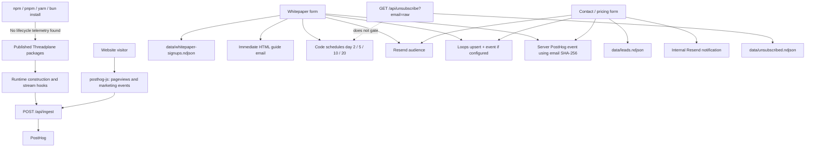
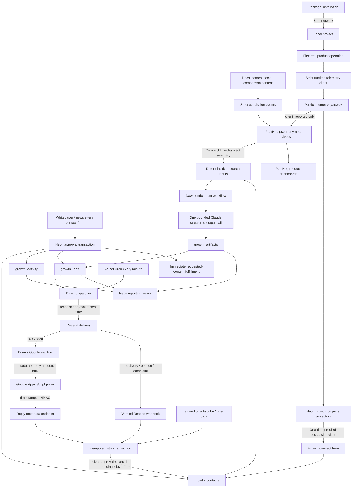
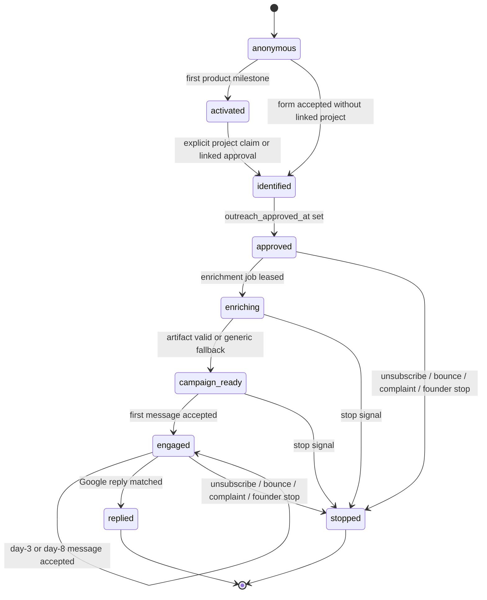

# Threadplane Growth, Telemetry, and Lifecycle V1

Status: Approved for implementation planning
Date: 2026-08-31
Scope: Threadplane public packages, website acquisition forms, PostHog telemetry, Neon growth CRM, Dawn lifecycle workflows, Resend delivery, and Google Workspace reply handling

## A. Executive summary

Threadplane already has the beginnings of a developer growth system, but the pieces are not yet a reliable funnel. The public repository contains a reusable telemetry package, runtime lifecycle hooks, browser and server-side PostHog capture, website forms, Resend delivery, Loops integration stubs, NDJSON lead storage, and a four-step whitepaper drip. The live Resend account inspection on 2026-08-31 found 14 contacts, 17 scheduled messages, 63 total emails, no Resend Automations, no custom events, no broadcasts, no templates, and no webhooks. The current sequence is therefore implemented in repository code, not in Resend Automations.

None of the inspected Threadplane source package manifests contains preinstall, install, postinstall, or prepare scripts. V1 preserves inert installation as an internal engineering requirement and adds a CI regression test. It is not promoted as a website guarantee.

The largest correctness defect is unsubscribe handling. The current endpoint accepts a raw email address in a GET query, appends it to a local NDJSON file, and returns success. It does not suppress the contact in the send path, cancel scheduled Resend messages, or synchronize provider state. Existing email templates expose raw email addresses in unsubscribe URLs. This can produce continued delivery after a displayed unsubscribe confirmation.

The public telemetry endpoint is also too permissive. It accepts an optional public key, any event beginning with tplane:, a caller-selected distinct ID, and arbitrary properties. Current runtime events describe construction and request mechanics rather than product value. Website PostHog creates person profiles for anonymous visitors, while server analytics derives stable identities from unsalted SHA-256 hashes of normalized email and sends email domains and company names to PostHog.

V1 replaces these loose integrations with one lean operating model:

1. Neon becomes the operational CRM and control plane using five tables.
2. One nullable timestamp, outreach_approved_at, is the only current send authorization.
3. New whitepaper signups grant approval through clear submission disclosure and receive the guide regardless of enrichment status.
4. Existing contacts are imported unapproved; existing scheduled messages are allowed to finish unless that contact stops.
5. A Vercel Cron dispatcher in a protected Dawn app leases due Neon jobs every minute. Dawn 0.8.21's supported Hono artifact runs behind an app-owned Vercel adapter that authenticates every Dawn path and uses dedicated Dawn Neon storage.
6. Deterministic research inputs feed one bounded Claude structured-output call, persisted as a reusable artifact.
7. One hardcoded plain-text campaign sends immediately, on day 3, and on day 8.
8. Each send rechecks approval. Reply, unsubscribe, hard bounce, complaint, or founder stop clears approval and cancels pending work.
9. Resend remains the delivery provider. Google Workspace owns replies. A small Apps Script poller matches reply headers without storing message bodies.
10. PostHog remains pseudonymous and analytical; it does not become the contact CRM.

The growth philosophy is product-led but not covert. Public runtime telemetry is enabled after a real product operation, never during installation or mere import. Five set-based activation milestones replace noisy request counts. All open-source runtime events remain client-reported and cannot independently qualify a person for outreach. Anonymous project activity can prioritize accounts and improve aggregate campaign strategy. Person-specific email requires a contact record and an active approval timestamp.

### Top ten actions

1. Create the five-table Neon control plane and reporting views.
2. Implement the idempotent stop transaction before sending any new campaign.
3. Replace raw-email unsubscribe URLs with signed opaque tokens and one-click headers.
4. Import the 14 live contacts unapproved and record the 17 scheduled messages as legacy jobs.
5. Cut whitepaper, newsletter, and contact capture over from NDJSON and Loops to Neon.
6. Replace the day-2/5/10/20 scheduler with one Neon-scheduled three-step campaign.
7. Add Google mailbox polling so natural replies stop the sequence within one to five minutes.
8. Replace permissive telemetry with exact versioned event schemas and five activation milestones.
9. Remove reversible email identities and anonymous PostHog person profiles.
10. Replace public telemetry documentation and trust claims with one canonical privacy policy; enforce inert installation only through code and CI.

## Decisions and non-goals

### Locked v1 decisions

- Installation and module import make zero outbound network requests.
- Runtime telemetry is enabled by default only after an eligible product operation.
- A random project UUID and local claim secret are created lazily after the first eligible event. TPLANE_PROJECT_ID may override the UUID; TPLANE_PROJECT_CLAIM_SECRET supports shared runtimes.
- Browser persistence uses localStorage. Node persistence uses an OS configuration file keyed locally by a digest of the working directory; the path and digest never leave the machine.
- DO_NOT_TRACK=1 and TPLANE_TELEMETRY_DISABLED=1 disable collection. TPLANE_TELEMETRY_DEBUG=1 prints the exact payload and endpoint without sending.
- PostHog contains no raw email, name, company, research text, message bodies, or deterministic email hashes.
- Neon is the CRM and source of truth.
- outreach_approved_at is the single current send authorization timestamp.
- New whitepaper signups are approved through visible submission disclosure. Existing Resend contacts remain unapproved.
- The campaign is one hardcoded three-message sequence: ready or within five minutes, day 3, and day 8.
- Every recipient-facing and internal lifecycle email is plain text with no visual template, tracking pixel, open tracking, or click rewriting. Campaign steps are no more than 120 words and written as Brian.
- The sender is Brian at Threadplane <brian@threadplane.ai>, subject to production domain verification.
- Resend sends mail and delivery webhooks. Google Workspace receives replies.
- A Google Apps Script poller inspects only recent metadata and RFC reply headers. Reply bodies are not sent to or stored by Threadplane.
- AI enrichment uses deterministic inputs plus one direct Anthropic structured-output request inside a Dawn workflow.
- AnyMailFinder, inferred contacts, external CRM sync, authentication, calendar integration, and account deanonymization are deferred.

### V1 non-goals

- No general campaign builder or sequence editor.
- No custom CRM UI.
- No multi-mailbox reply service.
- No meeting, opportunity, or customer lifecycle automation.
- No IP-to-company-to-employee automated prospecting.
- No autonomous web-browsing sales agent.
- No arbitrary customer-defined telemetry properties.
- No authoritative production-usage inference from public client events.

## B. Current-state architecture



### Current live vendor state

| System                | Verified state on 2026-08-31                                                                                            | Consequence                                                                                             |
| --------------------- | ----------------------------------------------------------------------------------------------------------------------- | ------------------------------------------------------------------------------------------------------- |
| Vercel                | Pro plan active                                                                                                         | Cron and protected deployments are available for v1.                                                    |
| Neon                  | PostgreSQL 17.11; existing public table rate_limit_events                                                               | Add isolated growth-prefixed tables and migrations.                                                     |
| PostHog               | Active free-tier project                                                                                                | Keep pseudonymous analytics and controlled cardinality. No application-level time expiry is configured. |
| Resend                | Active; 14 contacts, 17 scheduled messages, 63 total emails; no Automations, Events, Broadcasts, Templates, or Webhooks | Existing “automation” is repository code. Add webhooks and retain Resend as delivery only.              |
| Loops                 | No active workflow configuration                                                                                        | Remove integration from active v1 paths.                                                                |
| Google Workspace      | Business Starter                                                                                                        | Use Brian’s mailbox and one owner-run Apps Script for reply polling.                                    |
| CRM / auth / calendar | None                                                                                                                    | Neon is the v1 CRM; do not invent account identity or meeting signals.                                  |

## C. Target architecture



### Desired end-to-end funnel

Developer discovers Threadplane, reads useful architecture content, copies an install command, and installs locally with no telemetry. A real transport connection creates a lazy pseudonymous project identity and emits a client-reported milestone. Additional milestones describe the first successful stream, restored persistence, a successfully completed interrupt resume, and a real generative UI mount. The developer may later request an explicit claim link from the SDK, open the Threadplane connect form, and identify with visible outreach disclosure. A one-time local secret proves possession of that project without pretending the public UUID authenticates anything. Only then may Neon link project history to the contact. Approval authorizes a short founder-style campaign. Score selects a helpful topic and internal priority; it does not create permission. A reply returns to Brian’s Google mailbox, stops the sequence, and becomes a human conversation.

## D. Repository findings

Severity levels: Critical, High, Medium, Low, and Positive.

| Severity | Source location and component                                                                                                                                                                                                | Observed behavior and evidence                                                                                                                                                                                           | Recommended change                                                                                                                                                                                                                                                    |
| -------- | ---------------------------------------------------------------------------------------------------------------------------------------------------------------------------------------------------------------------------- | ------------------------------------------------------------------------------------------------------------------------------------------------------------------------------------------------------------------------ | --------------------------------------------------------------------------------------------------------------------------------------------------------------------------------------------------------------------------------------------------------------------- |
| Positive | All publishable package.json files; root package-lock.json                                                                                                                                                                   | No publishable Threadplane package declares preinstall, install, postinstall, or prepare. No Scarf dependency was found.                                                                                                 | Preserve and enforce with packed-package install network tests and dependency denylist checks.                                                                                                                                                                        |
| Critical | apps/website/src/app/api/unsubscribe/route.ts:5-29, GET                                                                                                                                                                      | Accepts raw email in the URL, appends it to unsubscribed.ndjson, and displays success. It does not suppress or cancel delivery.                                                                                          | Replace with opaque signed tokens, POST one-click handling, the canonical stop transaction, provider synchronization, and legacy raw-link compatibility.                                                                                                              |
| Critical | apps/website/lib/drip.ts:9-42, scheduleWhitepaperDrip                                                                                                                                                                        | Schedules fixed day-2, day-5, day-10, and day-20 messages directly in Resend. Future eligibility cannot be reliably rechecked.                                                                                           | Stop creating future provider schedules. Keep due_at in Neon and send only when each step becomes due.                                                                                                                                                                |
| High     | apps/website/emails/email-wrapper.ts:8-26, wrapEmail                                                                                                                                                                         | Uses a designed HTML card and raw-email unsubscribe URL.                                                                                                                                                                 | Replace campaign output with text-only founder email and opaque links plus List-Unsubscribe headers. Keep fulfillment email separately scoped.                                                                                                                        |
| High     | apps/website/src/app/api/whitepaper-signup/route.ts:14-79, POST                                                                                                                                                              | Stores PII in local NDJSON, immediately schedules drip, syncs Resend and Loops, and captures a stable PostHog identity. Errors are best-effort and route still returns success.                                          | Use one Neon transaction, immediate fulfillment job, explicit visible outreach notice, and idempotent lifecycle jobs.                                                                                                                                                 |
| High     | apps/website/src/app/api/leads/route.ts:10-72, POST                                                                                                                                                                          | Stores lead name, email, company, and message in NDJSON; pushes contacts to two providers; sends internal HTML; uses loose email validation.                                                                             | Store bounded fields in Neon, separate message text from analytics, approve only through visible form semantics, and run enrichment from persisted facts.                                                                                                             |
| Medium   | apps/website/src/app/api/newsletter/route.ts:8-50, POST                                                                                                                                                                      | Sends welcome mail and syncs Resend and Loops but has no durable local source of truth.                                                                                                                                  | Use Neon contact/approval/activity/jobs; keep newsletter fulfillment distinct from campaign steps.                                                                                                                                                                    |
| High     | apps/website/lib/loops.ts:1-62                                                                                                                                                                                               | Upserts every contact with subscribed:true when configured. A later form can overwrite provider state and there is no suppression coordination.                                                                          | Remove Loops from v1 active paths. Never allow provider contact state to override Neon authorization.                                                                                                                                                                 |
| High     | apps/website/src/lib/analytics/server.ts:17-20, getHashedEmailDistinctId                                                                                                                                                     | Creates stable public identities as SHA256(lowercase email), which is dictionary-reversible.                                                                                                                             | Use random immutable contact UUIDs in Neon. PostHog receives only a separate opaque UUID projection when identification is intentionally represented.                                                                                                                 |
| High     | apps/website/src/lib/analytics/server.ts:53-140                                                                                                                                                                              | Sends email_domain and company to PostHog and uses the email hash as distinct ID. captureLeadQualified equates non-personal email plus company text with qualification.                                                  | Remove PII/company properties and deterministic IDs. Treat the current qualification event as unverified form context, not sales qualification.                                                                                                                       |
| High     | apps/website/instrumentation-client.ts:8-15                                                                                                                                                                                  | Configures person_profiles: always and leaves the rest of PostHog’s default browser capture/persistence behavior active.                                                                                                 | Use explicit events only: identified-only profiles, autocapture/session recording/page auto-capture disabled, memory-only persistence, and sanitized manual pageviews.                                                                                                |
| High     | apps/website/src/app/api/ingest/route.ts:28-45, readPayload                                                                                                                                                                  | Public key is optional; any tplane-prefixed event is admitted; caller controls distinctId and arbitrary properties.                                                                                                      | Use exact schemas, body/property limits, gateway-owned reserved properties, UUID idempotency, timestamp tolerance, and rate limits.                                                                                                                                   |
| Medium   | apps/website/src/app/api/ingest/route.ts:63-70                                                                                                                                                                               | Correctly overwrites IP and person-profile flags after arbitrary property spread. This is a useful start but does not bound the rest of the object.                                                                      | Retain gateway overwrite behavior and reject unknown/reserved fields before forwarding.                                                                                                                                                                               |
| High     | libs/chat/src/lib/agent/runtime-telemetry.ts:3-18 and libs/telemetry/src/shared/events.ts:1-12                                                                                                                               | Current public events are runtime construction, request creation, stream start/end/error. They are noisy mechanics, not product-value milestones. Properties include provider and model.                                 | Replace the public contract with five value milestones and closed, low-cardinality properties.                                                                                                                                                                        |
| Medium   | libs/langgraph/src/lib/internals/stream-manager.bridge.ts:645-707                                                                                                                                                            | stream_started fires before a decoded event; stream_ended may fire for non-error outcomes weaker than successful activation.                                                                                             | Emit transport.connected on first decoded event and runtime.first_stream_completed only on successful completion, once per project.                                                                                                                                   |
| Medium   | libs/ag-ui/src/lib/to-agent.ts:184-225 and 302-325                                                                                                                                                                           | Construction/request/start events fire before value. RUN_FINISHED provides the success-specific seam.                                                                                                                    | Use RUN_STARTED for connected semantics and successful RUN_FINISHED for first stream.                                                                                                                                                                                 |
| Medium   | libs/telemetry/src/shared/anon-id.ts:3-8                                                                                                                                                                                     | Node anonymous ID persists only for the current process.                                                                                                                                                                 | Replace with lazy per-project UUID persistence after the first eligible event.                                                                                                                                                                                        |
| Medium   | libs/telemetry/src/browser/service.ts:66-160                                                                                                                                                                                 | Browser telemetry is currently explicit-provider enabled and permits arbitrary properties, in-memory distinct IDs, direct endpoint, or direct PostHog delivery.                                                          | Make product telemetry default-on at eligible operations while preserving explicit disable; funnel all public delivery through the strict first-party endpoint.                                                                                                       |
| Positive | libs/telemetry/src/shared/env.ts:1-31                                                                                                                                                                                        | Existing DO_NOT_TRACK and TPLANE_TELEMETRY_DISABLED behavior provides a sound opt-out base and also disables in CI.                                                                                                      | Retain; add debug-without-send behavior and document exact precedence.                                                                                                                                                                                                |
| Medium   | scripts/rate-limit.ts:14-16 and 53-67                                                                                                                                                                                        | Existing Neon limiter is intentionally fail-open and stores raw IP in rate_limit_events.                                                                                                                                 | Create a telemetry-specific limiter that HMACs IP, combines project/IP budgets, and drops telemetry when unavailable. Product execution must continue.                                                                                                                |
| High     | apps/website/src/components/landing/WhitePaperBlock.tsx:106-127 and AnnouncementToast.tsx                                                                                                                                    | Email submission does not currently display the short outreach disclosure needed for automatic campaign entry.                                                                                                           | Add concise visible text adjacent to submit: the guide plus a short email series from Brian, unsubscribe anytime.                                                                                                                                                     |
| Medium   | apps/website/lib/resend.ts:13-30                                                                                                                                                                                             | Fallback sender uses legacy Cacheplane identity and sendEmail has no text, headers, BCC, reply-to, tags, or returned provider ID.                                                                                        | Require the Threadplane sender, persist the returned Resend ID, add the opaque job header, and let the Gmail BCC seed register the RFC Message-ID; support text, BCC, reply-to, headers, and idempotency.                                                             |
| High     | apps/website/content/docs/telemetry/\*; src/lib/docs-config.ts:395-428; src/components/landing/Promises.tsx:6-42; src/components/landing/FinalCTA.tsx:15-33; src/app/llms.txt/route.ts:23-32; linked blog/narrative/API docs | The rendered website contains a dedicated Telemetry library, privacy/install claims, a “No hidden telemetry” promises section, a default telemetry caption, package listings, and many cross-links/generated references. | Remove the dedicated library and promise surfaces, remove or reword every rendered occurrence, redirect old documentation URLs to /privacy, and make /privacy the only website policy surface. Internal source/API names may remain outside rendered website content. |

### Verified versus inferred CopilotKit comparison

This table uses the prior CopilotKit repository investigation supplied in the task context. Threadplane repository behavior was independently verified in this audit. CopilotKit CRM and automated outreach consequences remain inference unless explicitly described as repository evidence.

| Capability              | CopilotKit behavior from supplied investigation                                   | Threadplane current behavior                                                       | Recommended Threadplane v1                                                                                                                             | Reason                                                               |
| ----------------------- | --------------------------------------------------------------------------------- | ---------------------------------------------------------------------------------- | ------------------------------------------------------------------------------------------------------------------------------------------------------ | -------------------------------------------------------------------- |
| Install telemetry       | Repository evidence reportedly includes Scarf in npm packages.                    | No lifecycle hooks or Scarf found in inspected source manifests.                   | Keep installation inert and CI-enforce it without a public guarantee.                                                                                  | Avoid false intent signals and regressions.                          |
| Company deanonymization | Repository and downstream architecture reportedly support account identification. | None found.                                                                        | Defer; never infer a person from IP/company in v1.                                                                                                     | Shared networks and VPNs make this noisy.                            |
| Developer enrichment    | Reo references reportedly include downstream email enrichment.                    | Form-provided contact/company only; Loops/Resend sync.                             | Research only contacts who identify and are approved.                                                                                                  | Explicit identity transition.                                        |
| Runtime telemetry       | First-party endpoint reportedly fans out to several vendors.                      | First-party endpoint forwards to PostHog.                                          | Keep one first-party gateway and one analytical processor in v1.                                                                                       | Lower fragility and clearer disclosure.                              |
| Browser identity        | Persistent IDs and Inspector attribution reportedly exist.                        | PostHog anonymous person profiles always; telemetry service has process-memory ID. | Short-lived browser session ID plus lazy project UUID; no anonymous person profile.                                                                    | Preserve useful funnels without hidden personal profiles.            |
| Identity stitching      | Cross-domain stitching reportedly supported.                                      | Email SHA-256 creates stable server identity; no robust project claim.             | Link project to contact only through explicit form/claim evidence in Neon.                                                                             | No silent anonymous-to-person conversion.                            |
| Attribution             | Multi-layer attribution reportedly exists.                                        | Website page/CTA/form events and source_page.                                      | Closed acquisition events and claimed-project linkage only.                                                                                            | Useful and explainable.                                              |
| Product activation      | Behavioral runtime signals reportedly collected.                                  | Construction/request/stream mechanics.                                             | Five set-based value milestones.                                                                                                                       | Measure product value, not noise.                                    |
| CRM creation            | Likely downstream account/contact creation; inferred.                             | Resend/Loops contacts plus NDJSON; no CRM.                                         | Neon five-table CRM.                                                                                                                                   | One canonical operational state.                                     |
| Marketing automation    | Likely CRM/email automation; inferred.                                            | Code schedules four Resend messages.                                               | One Neon-scheduled three-message sequence.                                                                                                             | Recheck eligibility at delivery time.                                |
| Cold outreach           | Person-specific outreach is a plausible downstream result; inferred.              | Current form signups receive scheduled drip.                                       | No outreach to anonymous or inferred contacts.                                                                                                         | Approval is the send boundary.                                       |
| Consent                 | Supplied investigation raises weak-consent concerns.                              | No durable consent/suppression model; form wording is incomplete.                  | One clear approval timestamp plus immutable provenance activity.                                                                                       | Startup-lean but auditable.                                          |
| Unsubscribe             | Not assessed here.                                                                | Raw-email NDJSON-only endpoint.                                                    | Signed token, one-click, canonical stop, provider sync.                                                                                                | Correctness requirement.                                             |
| Public policy           | CopilotKit behavior is discoverable across several technical surfaces.            | Threadplane currently publishes dedicated telemetry documentation.                 | Remove dedicated telemetry pages and consolidate public disclosure in one canonical privacy policy without event-by-event promises or trust marketing. | One maintainable legal/policy surface.                               |
| Telemetry security      | Public/client telemetry remains spoofable by nature.                              | Arbitrary tplane events/properties and caller IDs accepted.                        | Strict client-reported allowlist, dedupe, limits, and separate server events.                                                                          | Reduce metric poisoning without pretending public keys authenticate. |

## E. Prioritized implementation backlog

### P0 — security, privacy, and correctness

| Item                                    | Scope and rationale                                                                                                                                    | Affected files                                                                                            | Complexity | Dependencies           | Acceptance criteria                                                                                                |
| --------------------------------------- | ------------------------------------------------------------------------------------------------------------------------------------------------------ | --------------------------------------------------------------------------------------------------------- | ---------- | ---------------------- | ------------------------------------------------------------------------------------------------------------------ |
| P0.1 Neon control plane                 | Five canonical tables, migrations, typed queries, transactions, and views. Replaces ephemeral PII files and fragmented provider state.                 | New apps/website/src/lib/growth/_, db/migrations/_ or repo-standard migration location, apps/lifecycle/\* | L          | Neon DATABASE_URL      | Migrations are repeatable; concurrent approval/stop/send tests pass; all views query successfully.                 |
| P0.2 Canonical stop transaction         | Clear approval, append reason, cancel pending jobs, and synchronize provider state idempotently.                                                       | Growth repository, unsubscribe routes, provider webhook routes                                            | M          | P0.1                   | Repeated stop calls produce one durable result and no later campaign send.                                         |
| P0.3 Opaque unsubscribe                 | Signed token with key version and expiry policy; GET confirmation plus POST action; RFC one-click headers; legacy raw-email compatibility.             | api/unsubscribe, email sending helper, token utility                                                      | M          | P0.1, P0.2             | No new URL contains email; scanners cannot trigger confirmation-only GET; one-click POST stops immediately.        |
| P0.4 Delivery webhooks                  | Verify Resend signatures; persist provider IDs/status; bounce and complaint stop contact.                                                              | New api/webhooks/resend route, growth repository                                                          | M          | P0.1, P0.2             | Forged/replayed webhook rejected; hard bounce/complaint cancels all future jobs.                                   |
| P0.5 Google reply polling               | Owner-run Apps Script reads metadata/headers only and posts signed reply facts; server matches RFC Message-ID and stops.                               | New tools/google-mailbox-poller/\*, api/growth/replies/google route, email helper                         | M          | P0.1, P0.2             | A real or fixture reply stops within polling interval; body is absent from request, logs, and DB.                  |
| P0.6 Install inertness gate             | Scan publishable manifests/tarballs/dependency graph and run offline package-manager installs under network syscall monitoring.                        | New tools/verify-inert-install.\*, CI workflow, package tests                                             | M          | Published package list | npm, pnpm, yarn, and bun fixtures show zero AF_INET/AF_INET6 connect attempts attributable to lifecycle execution. |
| P0.7 Public ingest hardening            | Exact schemas, limits, dedupe, timestamp tolerance, HMAC-IP rate limit, reserved-property ownership.                                                   | api/ingest, shared telemetry schemas, rate-limit utility                                                  | L          | Neon                   | Malformed, spoofed, duplicated, oversized, stale, and abusive payload tests pass.                                  |
| P0.8 Remove reversible PostHog identity | Random contact/project projections; no raw company/domain PII; identified-only profiles.                                                               | analytics/server.ts, instrumentation-client.ts, analytics event types                                     | M          | P0.1                   | Automated scan and tests prove email/name/company/hash do not reach PostHog.                                       |
| P0.9 Sender and environment gate        | Verify threadplane.ai SPF, DKIM, DMARC, Return-Path, sender, List-Unsubscribe headers; add production delivery kill switch and environment separation. | Vercel/Resend config, send helper, runbook                                                                | S          | Domain owner action    | Production refuses campaign send if sender/domain verification or kill-switch policy fails.                        |

### P1 — v1 growth infrastructure

| Item                                                  | Scope and rationale                                                                                                                                                                                                                                                                                                                                                                                                                                                                                                                           | Affected files                                                                                                                                                                                                      | Complexity | Dependencies                   | Acceptance criteria                                                                                                                                                                                                                                                                                      |
| ----------------------------------------------------- | --------------------------------------------------------------------------------------------------------------------------------------------------------------------------------------------------------------------------------------------------------------------------------------------------------------------------------------------------------------------------------------------------------------------------------------------------------------------------------------------------------------------------------------------- | ------------------------------------------------------------------------------------------------------------------------------------------------------------------------------------------------------------------- | ---------- | ------------------------------ | -------------------------------------------------------------------------------------------------------------------------------------------------------------------------------------------------------------------------------------------------------------------------------------------------------- |
| P1.1 Form cutover                                     | Write whitepaper/newsletter/contact records to Neon, show disclosure, set approval for new eligible submissions, fulfill requested content.                                                                                                                                                                                                                                                                                                                                                                                                   | Three API routes; WhitePaperBlock, AnnouncementToast, Footer, ContactForm; tests                                                                                                                                    | L          | P0.1–P0.4                      | New submissions create one contact/activity/job set; fulfillment is independent of enrichment.                                                                                                                                                                                                           |
| P1.2 Legacy migration                                 | Import 14 contacts unapproved and 17 scheduled Resend IDs as legacy jobs; retain raw-link handler; no bulk cancellation.                                                                                                                                                                                                                                                                                                                                                                                                                      | One-off migration script, legacy adapter, runbook                                                                                                                                                                   | M          | P0.1, live Resend API          | Counts reconcile exactly; a stop cancels only matching pending legacy messages.                                                                                                                                                                                                                          |
| P1.3 Activation taxonomy                              | Replace mechanics with five value milestones across LangGraph, AG-UI, persistence, interrupts, and GenUI.                                                                                                                                                                                                                                                                                                                                                                                                                                     | libs/chat, libs/langgraph, libs/ag-ui, libs/render, libs/telemetry                                                                                                                                                  | L          | P0.7                           | Semantic tests prove each milestone fires once and only after the claimed success condition.                                                                                                                                                                                                             |
| P1.4 Lazy project identity, claim, and controls       | Browser/Node project UUID and claim-secret persistence, session UUID, explicit claim URL/connect flow, overrides, opt-out, debug, and silent failures.                                                                                                                                                                                                                                                                                                                                                                                        | libs/telemetry browser/node/shared; connect page/route                                                                                                                                                              | L          | P0.7                           | No ID/network before eligible operation; UUID alone cannot claim; one-time secret links explicitly; controls behave identically in tests.                                                                                                                                                                |
| P1.5 Dawn dispatcher                                  | Protected Vercel deployment of Dawn 0.8.21's Hono artifact through an all-path authenticated adapter, dedicated Dawn storage, minute cron, due-batch leasing, reclaim, retry/backoff, immediate nudge.                                                                                                                                                                                                                                                                                                                                        | New apps/lifecycle, project.json/package.json, Vercel adapter/config                                                                                                                                                | L          | P0.1                           | Duplicate cron invocations do not duplicate effects; expired leases recover; unauthenticated Dawn management and execution paths are rejected before delegation.                                                                                                                                         |
| P1.6 Bounded AI enrichment                            | Sanitized research inputs, company-page fetcher, compact linked PostHog summary, one Claude structured-output call, artifact validation.                                                                                                                                                                                                                                                                                                                                                                                                      | apps/lifecycle enrichment workflow and schemas                                                                                                                                                                      | L          | P1.5, Anthropic key            | One artifact contains bounded facts, sources, score reasons, and three valid drafts; failure degrades safely.                                                                                                                                                                                            |
| P1.7 Hardcoded campaign                               | Immediate/day-3/day-8 jobs, deterministic score/topic, text-only copy, send-time approval checks, internal summary.                                                                                                                                                                                                                                                                                                                                                                                                                           | lifecycle campaign modules, Resend helper, content files                                                                                                                                                            | L          | P0.2–P0.5, P1.5–P1.6           | Shadow and test-contact runs complete with no HTML tracking and stop correctly at every point.                                                                                                                                                                                                           |
| P1.8 Canonical privacy policy and public-copy cleanup | Delete the dedicated public telemetry library; remove Promises sections from home/pilot-to-prod; remove FinalCTA’s analytics caption; remove package/navigation/search/sitemap/llms references; reword blog, narrative, lifecycle, generated API copy, and public API response text; redirect old documentation URLs to /privacy. Create one /privacy policy covering categories, purposes, vendors, communications, indefinite default retention, deletion requests, and contact information without technical guarantees or event catalogs. | apps/website/content/docs/telemetry/\*; docs-config/docs tests/generators; Promises/FinalCTA and page callsites; llms routes; affected blog/docs/API content and ingest response strings; new privacy route/content | L          | Verified data/vendor inventory | A production website build and public endpoint scan contains no rendered case-insensitive occurrence of telemetry, no “what we won’t do” promise section, and no install/data-collection guarantee. Old /docs/telemetry URLs redirect to /privacy; /privacy is the sole canonical public policy surface. |

### P2 — optimization

| Item                   | Scope                                                                          | Complexity | Dependencies                          | Acceptance criteria                                               |
| ---------------------- | ------------------------------------------------------------------------------ | ---------- | ------------------------------------- | ----------------------------------------------------------------- |
| Reporting UI prototype | Read-only internal dashboard over approved Neon views.                         | L          | Stable v1 data                        | Reconciles with SQL views and exposes no campaign-send mutation.  |
| Score calibration      | Compare reason codes and tiers with replies and qualified conversations.       | M          | Adequate sample size                  | Versioned score function with documented before/after validation. |
| Campaign experiments   | Subject/topic variants at the artifact level, not cadence proliferation.       | M          | Baseline conversion data              | Deterministic assignment, minimum sample, stop-loss rule.         |
| Central Gmail API      | Replace owner Apps Script when multiple mailboxes or lower latency justify it. | L          | Google Cloud project and OAuth review | History cursor recovery and least-privilege operational runbook.  |

### P3 — advanced enrichment and experimentation

| Item                               | Scope                                                                        | Complexity | Dependencies                          | Acceptance criteria                                                                    |
| ---------------------------------- | ---------------------------------------------------------------------------- | ---------- | ------------------------------------- | -------------------------------------------------------------------------------------- |
| Account model and authentication   | Verified organizations, members, environments, and project claims.           | L          | Product auth strategy                 | Account signals are based on authenticated relationships.                              |
| AnyMailFinder evaluation           | Human-reviewed inferred-contact sourcing only for strong account intent.     | M          | Legal/policy review and account model | Source, confidence, recency, role fit, and human approval are required before contact. |
| CRM/calendar sync                  | Synchronize qualified records with a selected CRM and Google Calendar.       | L          | Vendor selection                      | Neon remains authoritative or ownership rules are explicit.                            |
| Agentic research                   | Tool-using research only after bounded deterministic v1 proves insufficient. | L          | Evaluation suite and cost controls    | Claims carry citations and human review; no direct send authority.                     |
| Multi-developer/commercial signals | Second developer, production confidence, opportunity, and customer state.    | L          | Auth/account/billing                  | Signals are verified and do not rely on IP coincidence.                                |

## F. Event taxonomy and version-1 schemas

### Trust classes

| Class                  | Meaning                                                                                         | May authorize outreach?                                           |
| ---------------------- | ----------------------------------------------------------------------------------------------- | ----------------------------------------------------------------- |
| browser_untrusted      | Website interaction from a browser.                                                             | No                                                                |
| public_client_reported | Open-source SDK/runtime event. Public keys and project IDs do not authenticate it.              | No                                                                |
| server_verified        | Event created by a protected Threadplane server integration after validating its own operation. | No; only the Neon approval timestamp authorizes                   |
| human_recorded         | Founder/admin action recorded through a protected interface or signed action.                   | May stop; may approve only through the dedicated approval command |

### Acquisition intent

These events are analytical only and use strict event-specific properties. Client-side success/failure form events are removed; the server emits contact.form_accepted after persistence.

Website PostHog initialization is explicit: person_profiles identified_only, autocapture false, disable_session_recording true, capture_pageview false, capture_pageleave false, persistence memory, and respect for DNT. Threadplane emits the sanitized pageview itself. Shared URL helpers strip query strings and fragments before capture. Crawler analytics retain only a closed crawler family enum; raw user-agent text is removed.

| Event                              | Allowed properties                                                                                                       |
| ---------------------------------- | ------------------------------------------------------------------------------------------------------------------------ |
| $pageview                          | pathname, with query and fragment removed                                                                                |
| marketing:cta_click                | cta_id, surface, source_page                                                                                             |
| marketing:lead_form_submit         | surface, source_page                                                                                                     |
| marketing:newsletter_signup_submit | surface, source_page                                                                                                     |
| marketing:whitepaper_signup_submit | paper, surface, source_page                                                                                              |
| marketing:content_engaged          | content_id from a versioned registry, content_kind: architecture, comparison, pricing, security, deployment; source_page |
| docs:install_command_copied        | package_name from the published-package enum, package_manager: npm, pnpm, yarn, bun; source_page                         |

content_engaged fires only after at least 30 seconds of active foreground time and 50 percent scroll depth on a registered page. A content ID contributes once per anonymous website session and once to a linked/project score, subject to the category caps. install_command_copied fires only from a code block explicitly annotated as an installation command; general code copy is not installation intent. All score-eligible acquisition and activation events are captured at 100 percent unless disabled. Non-scoring pageview sampling is controlled by the internal versioned schema/configuration registry.

Current event migration:

- marketing CTA and form-submit names remain, with the narrower properties above.
- docs:copy_code_click becomes docs:install_command_copied only for annotated install blocks; other code copies stop entering the growth contract.
- Client-side form success/fail, docs search strings/clicks, tab/sidebar interactions, blog code copy, destination URLs, CTA text, and raw crawler user agents are retired from the v1 growth contract.
- Server persistence, not a browser “success” event, records accepted forms.

### Product activation

Each project milestone counts once for scoring. Repeated events may be retained in sampled PostHog diagnostics but cannot raise the Neon score. Every activation properties object contains the common enums transport (langgraph, ag-ui, custom) and surface (agent, chat, render), plus only the event-specific fields below.

| Event                          | Exact success condition                                                                       | Event properties                                      |
| ------------------------------ | --------------------------------------------------------------------------------------------- | ----------------------------------------------------- |
| transport.connected            | First decoded LangGraph event or AG-UI RUN_STARTED observed after a real operation            | no additional fields                                  |
| runtime.first_stream_completed | First run that reaches the transport-specific successful terminal state                       | duration_bucket: lt_1s, 1s_to_5s, 5s_to_30s, 30s_plus |
| thread.persisted               | Successful restoration of a non-empty remote checkpoint that predated the current runtime     | persistence_kind: remote_checkpoint                   |
| interrupt.handled              | A resumed run successfully completes after provided, approved, rejected, or edited resolution | resolution_kind: provided, approved, rejected, edited |
| generative_ui.rendered         | First actual JSON Render or A2UI surface mounts; not merely a non-null spec                   | renderer: json_render, a2ui                           |

Construction, request-started, stream-started, and raw failure events are not part of the public v1 growth contract. Closed local error categories may remain available in debug or product observability that is not forwarded into the growth pipeline.

### Runtime integration boundary

- libs/telemetry owns the wire schemas, lazy project/session identity, controls, sampling, debug output, and first-party transport. It never initializes PostHog in a package consumer.
- @threadplane/chat takes a direct dependency on @threadplane/telemetry and supplies the built-in nonblocking milestone sink when an application does not override it. The public runtime options add telemetry: false as the explicit per-runtime disable; environment/programmatic disables still take precedence.
- LangGraph and AG-UI adapters invoke that built-in sink through the existing AgentRuntimeTelemetrySink seam; they do not each implement HTTP. Implementation should extend the existing activation/lifecycle seams in libs/langgraph/src/lib/lifecycle.ts and libs/render/src/lib/lifecycle.ts rather than duplicating instrumentation.
- Render exposes only the real mounted-renderer lifecycle fact. Chat combines it with project/session context before capture.
- A caller-provided sink remains supported for local inspection/testing. Explicit disable always wins over default and custom sinks.
- The first eligible fact initializes the local project ID. Construction, import, and dependency injection remain inert.
- The same lazy initialization creates a 32-byte claim secret. Its SHA-256 claim_key_hash is a registration control field that the gateway stores first-write-wins and never forwards to PostHog. The SDK includes the same hash on every eligible event until a successful gateway response explicitly acknowledges project registration.
- getThreadplaneProjectClaimUrl() is an explicit local API. It returns a threadplane.ai/connect URL with project ID and raw claim secret in the URL fragment. The SDK never opens, logs, or transmits that URL automatically.
- The connect page clears the fragment from browser history, displays the identity/outreach form, and submits the secret over HTTPS. The server compares its hash, consumes it once, links the project, and records project.claimed. The proof authenticates possession, not the truth of public activation events.

### Public runtime request

```json
{
  "event_id": "7bc9158e-f3c1-47f5-b3ca-43893af8d959",
  "event": "runtime.first_stream_completed",
  "schema_version": 1,
  "occurred_at": "2026-08-31T18:30:00.000Z",
  "sdk": {
    "name": "@threadplane/langgraph",
    "version": "1.2.3"
  },
  "project_id": "3dcf801e-803a-49cb-83f1-72c784357fd0",
  "project_claim_hash": "base64url-sha256-value-on-first-registration-only",
  "session_id": "bb83ca1a-ed4c-4c74-88e2-bc2d9b504063",
  "properties": {
    "transport": "langgraph",
    "surface": "agent",
    "duration_bucket": "1s_to_5s"
  }
}
```

project_claim_hash is required when project_id is unknown and optional only after the gateway has acknowledged registration. An unknown project without a valid hash is rejected before Neon insertion/analytics. Repeating the identical hash is idempotent; a different hash for an existing project is rejected and never changes the first-write value. The field is stored in Neon and stripped before analytics. The client cannot submit identity_state, verification, source, received_at, IP/person-profile controls, or any PostHog-reserved property. The gateway produces the normalized analytical event:

```json
{
  "event_id": "7bc9158e-f3c1-47f5-b3ca-43893af8d959",
  "event": "runtime.first_stream_completed",
  "schema_version": 1,
  "occurred_at": "2026-08-31T18:30:00.000Z",
  "received_at": "2026-08-31T18:30:01.000Z",
  "sdk": {
    "name": "@threadplane/langgraph",
    "version": "1.2.3"
  },
  "project_id": "3dcf801e-803a-49cb-83f1-72c784357fd0",
  "session_id": "bb83ca1a-ed4c-4c74-88e2-bc2d9b504063",
  "identity_state": "anonymous",
  "verification": "client_reported",
  "source": "public_runtime",
  "properties": {
    "transport": "langgraph",
    "surface": "agent",
    "duration_bucket": "1s_to_5s"
  }
}
```

Gateway rules:

- Maximum raw body: 8 KiB.
- JSON object depth: at most 3.
- No arrays except schemas that explicitly declare a bounded enum list; v1 public events require none.
- event_id, project_id, and session_id are UUIDs.
- occurred_at must be within 24 hours of gateway time.
- SDK name is one of the published Threadplane package names; version is bounded SemVer text.
- Unknown top-level fields, event names, properties, and enum values are rejected.
- Client-supplied properties beginning with $ are rejected.
- Gateway overwrites source, received_at, verification, IP behavior, and person-profile behavior.
- event_id is forwarded as PostHog $insert_id for downstream best-effort deduplication. A unique growth_activity milestone projection key, project:<project_id>:milestone:<event>, makes score contribution exactly-once without turning Neon into a raw telemetry lake.
- IP is HMACed for short-window rate limiting and never persisted as raw IP.
- Limiter failure drops telemetry but never affects product execution.

### Server events

Server events use a separate internal capture function or service-authenticated route and never pass through the public endpoint.

| Event                    | Properties                                                                                 |
| ------------------------ | ------------------------------------------------------------------------------------------ |
| contact.form_accepted    | contact_ref, form_type, source_page, optional paper                                        |
| project.claimed          | project_id, contact_ref, claim_method: one_time_secret, relationship: self_claimed_project |
| person.approval_recorded | contact_ref, approval_source, notice_version                                               |
| enrichment.completed     | artifact_id, status, confidence_band, policy_version                                       |
| campaign.step_accepted   | contact_ref, step, provider_ref                                                            |
| campaign.reply_received  | contact_ref, gmail_message_ref, matched_provider_ref                                       |
| campaign.stopped         | contact_ref, reason                                                                        |
| project.returned_7d      | project_id, first_session_date, return_session_date                                        |

Contact references sent to PostHog, if needed at all, are random opaque projections that cannot be joined outside Neon. Campaign bodies, research, raw email, names, and company text stay in Neon.

### Explicitly prohibited collection

- Prompt contents, chat messages, tool inputs, or tool outputs
- Arbitrary application state or customer-defined metadata
- Source code, files, environment variables, API keys, or secrets
- Raw exception messages, stack traces, or user-generated error strings
- Full URLs, query parameters, fragments, hostnames, or API endpoints
- Thread, run, assistant, or provider identifiers
- Raw email addresses, names, company names, or publicly reversible email hashes in PostHog
- Full user-agent strings or persisted raw IP addresses
- Company identity inferred solely from IP

## G. Data model

V1 intentionally uses five tables. PostHog owns pseudonymous event analytics. Neon owns people, authorization, durable work, artifacts, and the small business/control event history needed for reporting.

```sql
create extension if not exists citext;

create table growth_contacts (
  id uuid primary key default gen_random_uuid(),
  email_normalized citext unique,
  email_lookup_hmac text not null unique,
  email_hmac_key_version smallint not null,
  display_name text,
  company_name text,
  company_domain text,
  outreach_approved_at timestamptz,
  source text not null,
  created_at timestamptz not null default now(),
  updated_at timestamptz not null default now(),
  deleted_at timestamptz
);

create table growth_projects (
  id uuid primary key,
  contact_id uuid references growth_contacts(id),
  posthog_distinct_id uuid not null unique default gen_random_uuid(),
  claim_key_hash text not null,
  claim_consumed_at timestamptz,
  claim_method text,
  created_at timestamptz not null default now(),
  updated_at timestamptz not null default now()
);

create table growth_activity (
  id bigint generated always as identity primary key,
  event_key text not null unique,
  contact_id uuid references growth_contacts(id),
  project_id uuid references growth_projects(id),
  kind text not null,
  occurred_at timestamptz not null,
  data jsonb not null default '{}'::jsonb,
  created_at timestamptz not null default now()
);

create index growth_activity_contact_time
  on growth_activity (contact_id, occurred_at desc);
create index growth_activity_project_time
  on growth_activity (project_id, occurred_at desc);

create table growth_jobs (
  id uuid primary key default gen_random_uuid(),
  kind text not null,
  contact_id uuid references growth_contacts(id),
  project_id uuid references growth_projects(id),
  status text not null check (status in ('pending','leased','completed','failed','cancelled')),
  available_at timestamptz not null,
  lease_until timestamptz,
  lease_token uuid,
  attempts integer not null default 0,
  idempotency_key text not null unique,
  payload jsonb not null default '{}'::jsonb,
  provider_email_id text,
  rfc_message_id text,
  gmail_seed_message_id text,
  delivery_status text not null default 'not_submitted'
    check (delivery_status in (
      'not_submitted','submitted','delivered','bounced',
      'complained','suppressed','failed','unknown'
    )),
  last_error_code text,
  created_at timestamptz not null default now(),
  updated_at timestamptz not null default now()
);

create index growth_jobs_due
  on growth_jobs (available_at, id)
  where status = 'pending';
create unique index growth_jobs_provider_email
  on growth_jobs (provider_email_id)
  where provider_email_id is not null;
create unique index growth_jobs_rfc_message
  on growth_jobs (rfc_message_id)
  where rfc_message_id is not null;
create unique index growth_jobs_gmail_seed
  on growth_jobs (gmail_seed_message_id)
  where gmail_seed_message_id is not null;

create table growth_artifacts (
  id uuid primary key default gen_random_uuid(),
  job_id uuid not null unique references growth_jobs(id),
  contact_id uuid references growth_contacts(id),
  project_id uuid references growth_projects(id),
  kind text not null,
  schema_version integer not null,
  content jsonb not null,
  created_at timestamptz not null default now()
);
```

### Table responsibilities

- growth_contacts is the only raw contact mapping and current send authorization. email_lookup_hmac is an internal HMAC-SHA-256 lookup/suppression key, never an analytics identity. Active and previous key versions are accepted during rotation.
- growth_projects is the explicit bridge between pseudonymous product activity and a contact. contact_id remains null until a one-time proof-of-possession claim succeeds. The claim proves control of the locally generated secret, not truth of prior client-reported telemetry.
- growth_activity is append-only provenance and state history, not a duplicate raw analytics lake.
- growth_jobs is the queue, scheduler, outbox, retry state, legacy message ledger, and delivery record.
- growth_artifacts stores structured research, sources, score reasons, and three drafts.

### Mapping the requested conceptual entities

The original audit requested Contact, Account, Consent, Suppression, Activation, Event, Message, and Sequence models. V1 deliberately avoids eight separate tables:

| Concept            | Lean v1 representation                                                                                                         |
| ------------------ | ------------------------------------------------------------------------------------------------------------------------------ |
| Contact            | growth_contacts                                                                                                                |
| Account            | Deferred until authentication; growth_projects is a pseudonymous project, not an account                                       |
| Consent / approval | growth_contacts.outreach_approved_at plus provenance in growth_activity                                                        |
| Suppression        | Null approval timestamp, internal email_lookup_hmac, and immutable stop reason in growth_activity                              |
| Activation         | Set-based PostHog milestones plus project/activity projections needed for score                                                |
| Event              | PostHog for pseudonymous analytics; growth_activity for business/control events                                                |
| Message            | growth_jobs rows of kind fulfill, send_step, notify, or legacy plus explicit provider/RFC/Gmail references and delivery status |
| Sequence           | One versioned hardcoded policy; its materialized steps are growth_jobs rows                                                    |

Required views:

- growth_contact_overview_v1
- growth_funnel_daily_v1
- growth_campaign_performance_v1
- growth_job_health_v1
- growth_legacy_progress_v1

### Approval and stop rules

- outreach_approved_at non-null is necessary for campaign delivery.
- New whitepaper, newsletter, and contact submissions set it only after the visible approval notice is accepted by submission.
- A stop clears it in the same transaction that cancels pending jobs and appends the reason.
- A generic form upsert must not overwrite null with now() when prior activity contains unsubscribe, complaint, hard_bounce, or manual_suppression.
- Explicit reauthorization after those reasons requires a dedicated action and provenance event. A repeated whitepaper submission is not sufficient.
- Reply is a stop for the current sequence. It may be explicitly approved again later for a new conversation, but automation does not do that.

## H. Lead scoring model

The score is deterministic, versioned, and set-based. Claude cannot compute or change it.

| Signal                                        | Points | Cap / verification                                                                    |
| --------------------------------------------- | -----: | ------------------------------------------------------------------------------------- |
| Architecture or comparison content engagement |     +5 | Per registered content_id, cap +15; 30 active seconds plus 50 percent scroll          |
| Install command copied                        |     +5 | docs:install_command_copied once; acquisition intent, not activation                  |
| Pricing, security, or deployment engagement   |    +10 | Per registered content_id, cap +20                                                    |
| transport.connected                           |    +15 | Once per project; client-reported                                                     |
| runtime.first_stream_completed                |    +20 | Once per project; client-reported                                                     |
| thread.persisted                              |    +15 | Once per project; client-reported                                                     |
| interrupt.handled                             |    +15 | Once per project; client-reported                                                     |
| generative_ui.rendered                        |    +15 | Once per project; client-reported                                                     |
| Project returned within seven days            |    +15 | Derived once when a second distinct session occurs 24 hours to 7 days after the first |
| Approved work-email form submission           |    +30 | Server-verified approval transaction                                                  |

Tiers:

- Low: 0–14. Generic educational context.
- Medium: 15–39. Setup or next-milestone guidance.
- High: 40–69. Evidence-based architecture help and internal highlight.
- Very high: 70+. Founder-priority review.

Website content and install-copy signals can affect a contact only when the person identifies through a same-site form carrying the current short-lived acquisition session ID. Runtime activation signals can affect a contact only after the one-time project claim succeeds. Before those transitions they remain anonymous session/project scores. The same three-step cadence applies to every approved contact in v1. Score changes topic and internal priority, never send authorization. Anonymous project signals may prioritize projects but may not select an individual for cold email.

The gateway writes one growth_activity projection for the first accepted milestone in each project/session and derives project.returned_7d from those projections. Content IDs come from a versioned repository registry. Score dedupe keys are contact-or-project plus score_version plus signal plus content/milestone identifier. Caps apply inside one score version, and the score is recomputed rather than incremented imperatively.

Calibration begins only after enough reply and qualified-conversation outcomes exist. Retain score_version and reason codes on each artifact. Evaluate calibration by conversion rate per signal/tier, sample size, false-positive review, and incremental lift. Do not optimize against opens because open tracking is disabled. Primary outcomes are human reply, useful conversation, and later product/customer outcomes once those systems exist.

## I. Lifecycle state machine

The database does not need a lifecycle_state column in v1. State is a derived view over project linkage, approval, activity, jobs, and future commercial records.



Product-qualified, sales-qualified, opportunity, and customer are reporting concepts deferred until authentication, calendar, CRM, or billing provides authoritative evidence. Score tiers must not masquerade as those states.

## J. Email orchestration model

### Entry triggers

- Whitepaper signup: persist contact, record form/notice provenance, set approval if eligible, enqueue immediate plain-text guide fulfillment, enrichment, internal summary, and campaign step 1.
- Newsletter signup: persist contact, record provenance, set approval if eligible, send a plain-text welcome fulfillment, and enroll in the same campaign only once.
- Contact/pricing form: persist bounded submitted facts, set approval if eligible, enqueue enrichment/internal summary, and enroll once. The first email acknowledges the requested conversation rather than pretending it is a cold discovery.
- Explicit product approval: the /connect form submits contact data plus the one-time project claim secret and visible outreach approval, then follows the same transaction with linked product milestones.
- Anonymous telemetry alone: never enrolls a contact.

The v1 whitepaper notice is concise and adjacent to the submit action: “Send me the guide and a short, three-email follow-up from Brian about building with Threadplane. Unsubscribe anytime.” The contact form says, “By sending, you agree Brian may follow up by email about your request.” The newsletter notice says, “Subscribe to Threadplane updates and a short, three-email welcome from Brian. Unsubscribe anytime.” No hidden checkbox or separate consent table is introduced. The exact displayed string is versioned in growth_activity so the approval remains explainable.

Campaign entry scope is intentionally limited to these three clearly disclosed first-party forms and the explicit /connect project-claim form. Contact-form copy branches to direct-request follow-up, but uses the same three due steps and stop machinery. No other form, imported provider contact, anonymous event, or inferred contact enrolls automatically.

### Dispatcher

Vercel Cron calls the protected Dawn dispatcher every minute. Dawn 0.8.21 does not ship a native Vercel target, so the lifecycle app builds the supported Hono target and places an app-owned Vercel adapter in front of it. The adapter validates the dedicated service bearer token on every Dawn path before delegation; Dawn route middleware repeats the check on execution paths. Dawn thread/checkpoint/permission storage uses `DAWN_DATABASE_URL`, which must identify an app-dedicated Neon database or schema and must never fall back to the growth CRM `DATABASE_URL`. Approval endpoints make a best-effort immediate nudge, while cron is the durable recovery path. The dispatcher:

1. Claims a bounded due batch with FOR UPDATE SKIP LOCKED.
2. Applies a renewable lease and increments attempts.
3. Rechecks contact exists, is not deleted, outreach_approved_at is non-null, and no applicable stop reason supersedes approval.
4. Requires the prior campaign step to have been accepted before steps 2 or 3.
5. Sends one message through Resend with a durable Neon idempotency key and X-Threadplane-Job-ID containing the opaque growth job UUID.
6. Persists the returned Resend API email ID. The Google BCC seed later registers the RFC Message-ID and Gmail seed ID against that job.
7. Marks completion or schedules bounded retry.

Future campaign steps are never scheduled inside Resend. Neon holds available_at until the step is due.

If the process cannot determine whether Resend accepted a send, delivery_status becomes unknown and the job requires manual review. It is not blindly retried after Resend’s idempotency window. Provider webhook events are appended to growth_activity with unique provider event keys and update the closed delivery status. The reporting view exposes submitted, delivered, bounced, complained, suppressed, failed, and unknown.

Resend sent/delivered/delivery-delayed/bounced/complained/failed/suppressed events are verified and mapped into that closed model. Open and click tracking are disabled at send configuration; open/click events are neither subscribed nor used if unexpectedly received.

### Enrichment

The Dawn enrichment route is a deterministic workflow, not a tool-using Dawn agent:

- Inputs: approved form facts, bounded company-domain pages, source URLs, deterministic score/reasons, and compact telemetry summary only when the project is explicitly linked.
- Company fetch: HTTPS only, public DNS/IP only, strict redirect and byte/page limits, no arbitrary submitted URL.
- Model: LIFECYCLE_ENRICHMENT_MODEL or claude-sonnet-4-6.
- Direct Anthropic client with timeout 30 seconds and maxRetries 0.
- One messages.parse request using a Zod 4 output format, maximum 1,200 output tokens, and the Dawn AbortSignal.
- The Neon scheduler owns one retry and backoff.
- Output: bounded summary, confidence band, factual signals with evidence, company profile, score version/reasons, recommended angle, sources, and three subject/body drafts.
- Unknown facts produce neutral language. No invented customers, urgency, role, product use, or personal detail.

apps/lifecycle should declare Dawn Core/CLI/LangGraph/Postgres Storage/SDK 0.8.21, `@neondatabase/serverless` 0.10.4, Hono 4.13.5, @anthropic-ai/sdk, and Zod 4 rather than relying on root hoisting. Dawn’s Node 24 requirement must be reflected in the deployment. Its build selects the supported Hono target; the app-owned Vercel adapter and post-build verifier fail closed if Dawn's generated `app.mjs` or fetch-compatible default export changes.

### Campaign

| Step | Due                                                                       | Purpose                                                                                                         |
| ---- | ------------------------------------------------------------------------- | --------------------------------------------------------------------------------------------------------------- |
| 1    | As soon as artifact is ready; neutral fallback no later than five minutes | Acknowledge guide/product context, offer one useful observation, ask what they are building.                    |
| 2    | Day 3                                                                     | Help with one missing activation milestone and ask for the blocking detail.                                     |
| 3    | Day 8                                                                     | Offer concise architecture help, ask one reply-oriented question, and state it is the last automated follow-up. |

Copy constraints:

- All recipient fulfillment, welcome, acknowledgment, and campaign mail uses Resend’s text field rather than an HTML template.
- Internal research and operational notifications are plain text as well.
- Each campaign step is at most 120 words.
- One question and at most one useful link.
- No banner, button, HTML layout, tracking pixel, open tracking, or click rewriting.
- Never say “I saw you…” based on telemetry.
- No calendar link in v1.
- From and Reply-To are Brian at Threadplane <brian@threadplane.ai>.
- BCC Brian on every recipient-facing email that may begin a conversation. The email carries X-Threadplane-Job-ID so the Google poller can register the BCC seed’s actual RFC Message-ID; seed copies are never treated as recipient replies.

### Stop conditions

- Google mailbox reply, including out-of-office response
- Signed unsubscribe or RFC one-click unsubscribe
- Resend hard bounce or complaint
- Provider suppression or invalid address
- Founder stop link
- Contact deletion

Every stop invokes the same idempotent Neon transaction, then best-effort provider synchronization. Internal notification failure never blocks fulfillment or an approved send.

### Google mailbox polling

A small Google Apps Script runs as brian@threadplane.ai every one to five minutes:

1. Read a cursor from Script Properties.
2. Re-scan a bounded overlapping window oldest-first so delayed seed/reply ordering is recoverable.
3. Inspect only recent Gmail message metadata, Message-ID, X-Threadplane-Job-ID, In-Reply-To, and References headers.
4. Treat mail from Brian containing X-Threadplane-Job-ID as a seed registration, not a stop. Post job UUID, Gmail seed ID, and RFC Message-ID.
5. Treat other inbound mail with In-Reply-To or References as a reply candidate. Post Gmail message ID, sender, references, timestamp, and nonce.
6. Sign every request with a dedicated HMAC secret.
7. Advance the high-water cursor only after acknowledged processing; the overlap plus server idempotency handles duplicates.

The server verifies timestamp/HMAC, rejects replay, and deduplicates Gmail message ID. Seed registration binds the opaque job UUID to its Gmail and RFC Message-IDs only when the job is a valid accepted send. A reply maps its References chain to that registered send and never guesses by sender address alone. On a match it clears approval, records campaign.reply_received metadata, and cancels pending v1 and matching legacy jobs. An unmatched reply becomes a reply_reconcile job containing headers only; it retries after seed registration and eventually requires founder review rather than being discarded.

The script receives broad Gmail permission in the lean owner-operated v1. A centralized Gmail API history watcher is deferred until multiple mailboxes, restricted-scope operations, or lower latency justify the additional infrastructure.

## K. Privacy and internal data-handling specification

### Threadplane collects

- Closed acquisition events such as pathname-only pageview, CTA ID, surface, source page, form type, and whitepaper ID.
- Five closed product activation milestones with package/version, transport/surface enums, random project/session IDs, and small event-specific enums/buckets.
- Contact data that a person submits directly to a Threadplane form, stored in Neon.
- Approval source, notice version, timestamp, stop reason, delivery IDs/status, bounded research facts/sources, deterministic score/reasons, and generated drafts in Neon.
- Google reply metadata required to match a sent message and stop automation.

### Technical collection exclusions

The prohibited analytics list in section F is an internal engineering constraint, not website copy. The Gmail poller does not transmit or store reply body text. PostHog excludes raw contact PII, research content, and campaign copy. AI model inputs exclude prompt/chat/tool content and unrelated CRM notes.

### Identity creation and transition

- Installation and import create no identity.
- The first eligible product milestone lazily creates a random project UUID locally.
- A random session UUID lasts one process or page session.
- Product identity remains pseudonymous until the explicit /connect form proves possession of the one-time local project secret.
- Neon records the relationship and provenance; PostHog does not receive the raw contact mapping.
- Anonymous behavior never silently creates a subscribed marketing contact.

### Outreach effect

- Anonymous events may affect aggregate reporting and project priority.
- Linked product milestones may affect topic and score after explicit identification.
- Only outreach_approved_at authorizes a send.
- AI output, inferred company, email domain, and score cannot create approval.

### Retention and deletion

Default v1 policy:

- Threadplane configures no time-based expiration for PostHog analytics, Neon contacts/activity/jobs/artifacts, generated research/drafts, or delivery records. They are retained indefinitely by default, subject to provider operational limits.
- Reply bodies and raw company-page content are not added to the growth database. Bounded extracted company facts, source URL, retrieval time, and content hash are retained indefinitely.
- A verified deletion request nulls raw contact fields, removes the project mapping, cancels jobs, and deletes research/drafts where operationally supported.
- The internal versioned email_lookup_hmac and minimal delivery/stop audit remain after deletion to prevent accidental re-contact.
- The canonical privacy policy states indefinite default retention and explains how to request deletion. It does not publish event-level retention schedules.

### Developer controls

- DO_NOT_TRACK=1
- TPLANE_TELEMETRY_DISABLED=1
- Programmatic disable API
- TPLANE_PROJECT_ID with a valid UUID
- TPLANE_PROJECT_CLAIM_SECRET for shared runtimes that need one stable explicit claim
- TPLANE_TELEMETRY_DEBUG=1 to print payload and endpoint without sending

These remain code-level controls. They are not presented as a dedicated website telemetry surface or marketing promise.

### Canonical website privacy policy

The public website has one policy route, /privacy. It uses general data-category language rather than an event catalog and covers:

- information submitted through forms and communications;
- website and product analytics;
- purposes such as operating the product, understanding usage, research, support, and approved outreach;
- processors including Vercel, Neon, PostHog, Resend, Google Workspace, and Anthropic;
- email opt-out and reply handling;
- indefinite default retention;
- deletion/contact requests;
- security, international processing, policy changes, and contact information.

The website removes dedicated telemetry documentation, event/property examples, install-behavior claims, “never collected” lists, trust-differentiator positioning, and other absolute promises. Internal schemas, tests, source comments, and runbooks may continue to use the term telemetry where technically appropriate.

## L. Security specification

### Telemetry authentication model

Public browser and SDK keys are attribution identifiers, not authentication. Public events are always labeled client_reported. Server-verified events use an internal function or a separate service-authenticated route. A client cannot submit or override verification, source, received_at, IP, person-profile, or server event names.

### Schema and abuse controls

- Exact versioned schemas with additionalProperties false.
- 8 KiB body, depth 3, bounded strings/integers/enums.
- UUID event IDs and 24-hour timestamp tolerance.
- Event ID idempotency and set-based milestone scoring.
- Per-IP and per-project fixed-window budgets using HMACed IP.
- Fail-closed telemetry rate limit; fail-open product runtime.
- Alert on reject rate, project fan-out, event-ID collision, unusual event distribution, and PostHog cardinality growth.

### Webhook and scheduler security

- Verify Resend webhook signature against the raw request body.
- Reject stale/replayed provider event IDs.
- Protect Vercel Cron with `CRON_SECRET`. Protect every Dawn path at the app-owned Vercel adapter with a distinct lifecycle service secret; retain Dawn execution middleware as defense in depth.
- Google poller uses a distinct timestamped-HMAC secret and nonce; rotate separately.
- Founder stop and unsubscribe use purpose-specific, versioned signed tokens.
- Secrets are Vercel/Apps Script properties only and never NEXT_PUBLIC variables.

### Unsubscribe tokens

Token payload contains random contact ID, purpose, key version, and issued-at value. The token is authenticated with HMAC-SHA-256. URLs contain no raw email. GET renders confirmation for human links. POST performs the state change. RFC List-Unsubscribe-Post supports one-click POST. Token validation is constant-time and idempotent. Legacy raw-email GET links remain a compatibility adapter but immediately route into the same stop transaction.

### Environment separation

- Production, preview, and test use separate Vercel environments and Neon branches/databases. Preview/test must never point at the production growth tables. Each environment also supplies a dedicated `DAWN_DATABASE_URL`; Dawn runtime tables must not share the growth `DATABASE_URL` implicitly.
- Production delivery requires verified sender configuration and DELIVERY_ENABLED=true.
- Test mode redirects or allowlists recipients.
- Internal and recipient emails use separate send helpers/policies and provider tags.
- A global kill switch stops leasing send_step jobs without blocking fulfillment or stop handling.

## Threat model

| Risk                                  | Severity | Likelihood | Current exposure                                            | V1 mitigation                                                                                                                   |
| ------------------------------------- | -------- | ---------- | ----------------------------------------------------------- | ------------------------------------------------------------------------------------------------------------------------------- |
| Fake telemetry / competitor poisoning | High     | Medium     | Any tplane event/property and caller ID accepted            | Exact schemas, limits, dedupe, project/IP budgets, set-based score, client_reported label                                       |
| Event replay                          | Medium   | High       | No event UUID/idempotency                                   | UUID event_id, insertion dedupe, milestone existence scoring                                                                    |
| Distinct-ID impersonation             | High     | Medium     | Caller supplies arbitrary distinctId                        | Gateway validates project UUID but treats it as untrusted; no person outreach from it                                           |
| Project claim theft or replay         | High     | Low        | New v1 identity bridge                                      | 32-byte local secret, hash-only registration, fragment URL, immediate fragment clearing, one-time consumption, replay rejection |
| Oversized/high-cardinality payload    | High     | Medium     | Arbitrary nested properties                                 | 8 KiB, depth/property limits, enums, reject unknowns                                                                            |
| Suppression bypass                    | Critical | High       | Unsubscribe file not checked before send                    | One send gate and atomic stop transaction                                                                                       |
| Accidental resubscription             | High     | Medium     | Loops writes subscribed:true on upsert                      | Neon approval command checks prior hard-stop activity; providers never authorize                                                |
| Email enumeration                     | Medium   | Medium     | Raw email unsubscribe URL and distinguishable errors        | Opaque tokens and uniform responses                                                                                             |
| Unsubscribe link scanner / CSRF       | High     | Medium     | GET mutates state                                           | Human GET confirmation, one-click POST, purpose-bound token                                                                     |
| Leaked founder-stop URL               | Medium   | Low        | New signed action                                           | Short-lived purpose-bound token, POST confirmation, idempotent stop-only capability                                             |
| Reply missed and later email sent     | High     | Medium     | No reply integration                                        | Gmail poller, one-to-five-minute interval, due-time send gate, founder fallback                                                 |
| PII in logs                           | High     | Medium     | Error logs can include email; NDJSON stores raw form bodies | Structured reason codes, log redaction, Neon access control, no body logs                                                       |
| Email hash reversal                   | High     | High       | Unsalted SHA-256 email distinct ID                          | Random analytics IDs; private versioned HMAC only for Neon lookup/suppression                                                   |
| User text entering analytics/AI       | Critical | Medium     | Arbitrary analytics properties and contact message flow     | Closed schemas; explicit bounded AI inputs; message text never enters PostHog                                                   |
| Webhook spoofing                      | High     | Medium     | No webhooks today                                           | Raw-body signature verification, replay protection                                                                              |
| Provider compromise                   | High     | Low        | Resend and PostHog hold data                                | Data minimization, no email bodies in PostHog, scoped keys, rotation/runbook                                                    |
| Production/test mixing                | High     | Medium     | Best-effort sends and shared defaults                       | Environment tags, allowlists, verified sender gate, kill switch                                                                 |
| Employee access to customer prompts   | Critical | Low        | Growth design could expand data                             | Prompts/tools/messages never collected; no UI exists to browse them                                                             |
| Stale enrichment                      | Medium   | Medium     | No current model                                            | Retrieval timestamps, source URLs, confidence, refresh-on-approval only                                                         |
| VPN/shared-IP account misattribution  | High     | High       | IP available at ingress                                     | Never persist raw IP or create account/contact from IP                                                                          |
| SSRF in company research              | Critical | Medium     | New v1 surface                                              | Domain-derived HTTPS only, DNS/IP checks, redirect/size/time limits                                                             |
| AI fabricated personalization         | High     | Medium     | New v1 surface                                              | Structured evidence, citations, bounded prompt, neutral fallback, internal visibility                                           |
| Gmail permission compromise           | High     | Low        | New broad owner script permission                           | One owner account, minimal code, metadata-only behavior, dedicated secret, audit/revoke runbook                                 |

## M. Test specification

### Installation and SDK

1. Pack every publishable package and inspect the packed manifest for lifecycle scripts.
2. Resolve the packed dependency graph and fail on Scarf or configured analytics-install dependencies.
3. Prewarm npm, pnpm, Yarn, and Bun fixture stores, then install local tarballs offline under Linux network-syscall tracing.
4. Assert no AF_INET or AF_INET6 connection occurs during package lifecycle execution.
5. Import each package and assert no fetch, HTTP, HTTPS, DNS, socket, file-ID, or localStorage write.
6. Execute first eligible runtime operation and assert exactly one lazy project ID creation.
7. Set DO_NOT_TRACK and Threadplane-specific disable flags; assert no ID creation and no network.
8. Set debug mode; assert exact payload/endpoint output and no network.
9. Force telemetry timeout, DNS error, 400, 429, and 500; assert product API behavior is unchanged.

### Telemetry ingestion

10. Accept every allowlisted event with exact properties.
11. Reject unknown event, unknown property, server event, malformed UUID/SemVer/time, stale/future time, oversized body, deep nesting, forbidden content, and any client $ property.
12. Prove caller verification, source, IP, and person-profile values cannot survive.
13. Submit duplicate event IDs; assert the same PostHog $insert_id is forwarded and exactly one Neon milestone projection/score contribution exists. Do not claim the gateway makes exactly one network call to PostHog.
14. Replay valid activation with new event IDs; assert milestone score is still counted once.
15. Exceed IP and project budgets; assert drop/429 policy and no product exception.
16. Make limiter unavailable; assert telemetry drops and runtime continues.
17. Verify separate server capture rejects public credentials.
    17a. Assert website PostHog initializes with explicit-only capture, no session recording, memory persistence, identified-only profiles, and no auto-pageview.
    17b. Assert shared URL sanitization strips query/fragment and crawler capture sends only a closed family enum, never raw user-agent text.
    17c. Unknown project without claim hash is rejected; a lost first response causes the SDK to resend the identical hash; registration acknowledgment stops resending; a conflicting hash never replaces the stored value.

### Activation semantics

18. LangGraph: no milestone at construction/request/start; connected on first decoded event; first stream only after successful outcome.
19. AG-UI: connected on RUN_STARTED; first stream only on successful RUN_FINISHED; error/abort/pause do not count.
20. Persistence: newly created post-run history does not count; successful restore of pre-existing checkpoint counts once.
21. Interrupt: submission alone does not count; successful resumed completion counts once and never transmits resolution payload.
22. GenUI: non-null render spec alone does not count; actual JSON Render/A2UI mount counts once.

### Approval, identity, and forms

23. New disclosed whitepaper submission creates contact, approval, provenance, fulfillment, enrichment, and campaign jobs once.
24. Fulfillment succeeds even when enrichment or approval is absent/failed.
25. Anonymous project remains unlinked until the one-time secret proves possession; wrong, replayed, consumed, or UUID-only claims cannot link it.
26. The claim URL fragment is cleared before navigation/logging, and successful claim links the correct contact with provenance while retaining client_reported trust for product events.
27. Form data and identity transition emit no raw email/name/company/hash to PostHog.
28. A previously unsubscribed/complained/hard-bounced contact resubmitting a generic form remains unapproved.
29. Explicit reauthorization records a new event and timestamp when policy allows it.
30. Deletion cancels jobs, removes mappings/artifacts, preserves only the private suppression HMAC, and cannot be reversed by stale jobs.

### Email, stop, and provider behavior

31. Duplicate cron/lease execution with a known provider acceptance produces one submission; an ambiguous response becomes delivery_status unknown and is not automatically retried outside the provider idempotency window.
32. Step 2/3 requires prior provider acceptance and active approval at the final send check.
33. Signed unsubscribe token succeeds idempotently; tampered, wrong-purpose, expired-policy, and unknown-key tokens fail uniformly.
34. One-click POST stops without a cookie; confirmation GET does not mutate.
35. Legacy raw-email link invokes the same stop transaction without exposing new raw-email links.
36. Stop cancels all pending Neon jobs and matching scheduled legacy Resend IDs.
37. Race unsubscribe against send; transaction/send gate prevents later submission or records the bounded provider race for manual action.
38. Verified hard bounce and complaint clear approval and cancel future jobs.
39. Forged or replayed Resend webhooks do nothing.
40. New form after stop cannot accidentally resubscribe.
41. Every recipient/internal lifecycle helper sends text only; campaign has no pixel, open tracking, click rewrite, calendar link, or more than one content link.
42. sent/delivered/bounced/complained/suppressed/failed webhook fixtures update the closed delivery status and append one idempotent activity row per provider event.

### Google reply polling

43. BCC seed from Brian registers X-Threadplane-Job-ID, Gmail seed ID, and RFC Message-ID without stopping the poller.
44. Recipient reply with In-Reply-To matches stored RFC Message-ID and stops the sequence.
45. References fallback works when In-Reply-To is absent.
46. Out-of-office response stops the sequence.
47. Duplicate Gmail message ID is idempotent.
48. Stale/tampered HMAC and nonce replay are rejected.
49. Unknown referenced Message-ID does not guess by sender, persists a reply_reconcile job, and retries after seed registration.
50. Request, logs, activity, jobs, and artifacts contain no reply body.
51. Cursor does not advance past an unacknowledged batch; overlapping oldest-first windows recover reply-before-seed processing.
52. A real Workspace smoke test proves the BCC seed and recipient reply appear in one Gmail thread and Brian’s manual reply targets the recipient.

### AI enrichment

53. Personal-email domain skips company fetch and produces neutral copy.
54. SSRF cases including localhost, private IP, redirect-to-private, oversized response, and non-HTTPS fail closed.
55. Claude structured output is length/enum/source validated.
56. Timeout or malformed output retries once via scheduler, then creates neutral fallback by five minutes.
57. AI output cannot set approval, score, due time, recipient, or send status.
58. Generated copy uses only cited facts and satisfies word/question/link/style limits.

### Canonical privacy policy and rendered website

59. Build the production website and assert no rendered HTML, JSON search index, sitemap metadata, llms.txt/llms-full.txt, generated public context, or public API response body contains a case-insensitive telemetry occurrence.
60. Assert the home and pilot-to-prod pages no longer render the Promises section and FinalCTA renders no analytics/privacy caption.
61. Assert every former /docs/telemetry route redirects to /privacy without rendering an intermediate claim page.
62. Assert /privacy is linked from the global footer and is the only public policy page for analytics/data-handling disclosure.
63. Assert /privacy covers data categories, purposes, named processor categories/vendors, communications, indefinite default retention, deletion requests, policy changes, and contact information.
64. Assert /privacy contains no event/property catalog, installation behavior claim, “never collected” list, trust-differentiator copy, or absolute guarantee.
65. Regenerate the smallest relevant public docs/context artifacts and repeat the rendered-output scan so generated API/narrative content cannot reintroduce removed wording.

## N. Recommended PR sequence

### PR 1 — Add the Neon growth control plane

- Goal: land five tables, typed repository, transactions, leases, score function, and reporting views with no external behavior change.
- Approximate files: migration files; apps/website/src/lib/growth/\*; shared schemas; database tests.
- Migration risk: Low to medium; additive tables only.
- Rollout: apply preview migration, run fixtures/concurrency tests, then production migration.

### PR 2 — Make every stop durable

- Goal: implement canonical stop, opaque unsubscribe/one-click, Resend delivery webhooks, Google reply endpoint/poller, founder stop, and provider-ID ledger.
- Approximate files: api/unsubscribe; api/webhooks/resend; api/growth/replies/google; tools/google-mailbox-poller; Resend helper; growth repository.
- Migration risk: Medium; introduces provider callbacks and Google authorization.
- Rollout: internal test contacts only; verify all stop paths before any new campaign exists.

### PR 3 — Cut forms and legacy state over to Neon

- Goal: change whitepaper/newsletter/contact forms to Neon approval/fulfillment, import 14 contacts and 17 scheduled IDs, and stop creating old Resend schedules.
- Approximate files: three API routes; form components; migration script; drip/Loops adapters; route tests.
- Migration risk: Medium to high; active acquisition path.
- Rollout: reconcile snapshot counts, deploy with old path kill switch, canary one form, then all forms. Existing scheduled mail is not bulk-cancelled.

### PR 4 — Replace public promises with the canonical privacy policy

- Goal: remove the dedicated telemetry documentation/library and every rendered website mention, remove the Promises sections and FinalCTA analytics caption, add /privacy, redirect old routes, and prevent generated content from reintroducing the wording.
- Approximate files: apps/website/content/docs/telemetry/\*; docs-config/docs tests/generators; page/Promises/FinalCTA callsites; llms routes; affected blogs/docs/API outputs; new privacy page; redirects.
- Migration risk: Medium; public documentation URLs and marketing content change.
- Rollout: build and crawl preview, verify old-route redirects and global footer link, run the rendered-output scan, then deploy before default-on product analytics.

### PR 5 — Ship the strict activation and explicit project-claim contract

- Goal: harden public ingest, create lazy project/session/claim identities, emit five milestones, add the explicit /connect proof-of-possession flow, add opt-out/debug, and update PostHog privacy settings.
- Approximate files: libs/telemetry; libs/chat; libs/langgraph; libs/ag-ui; libs/render; api/ingest; new connect page/route; analytics server/client; internal schema tests.
- Migration risk: Medium; analytics contract changes but runtime behavior must remain unaffected.
- Rollout: shadow validation and sampled forwarding, compare reject rates, then enable default-on eligible events.

### PR 6 — Add the Dawn enrichment and dispatcher service

- Goal: protected apps/lifecycle deployment using Dawn 0.8.21's Hono output behind an all-path authenticated Vercel adapter, dedicated Dawn Neon storage, Vercel Cron, job leasing, deterministic research, one Claude structured call, artifact persistence, and internal summary. No time-based cleanup is added.
- Approximate files: new apps/lifecycle/\*; project config; Vercel config; schemas; integration tests.
- Migration risk: Medium; new isolated service.
- Rollout: shadow jobs and internal/test contacts; delivery kill switch and cron remain off until the adapter dogfood checklist passes and findings are sent to Dawn task `01a05e2f-7e93-7bd0-af74-f13d5a7719cd` for generalized backport.

### PR 7 — Enable the three-step founder campaign

- Goal: activate score/topic selection and ready/day-3/day-8 text-only sends with final approval checks and reporting.
- Approximate files: lifecycle campaign modules; text content/prompts; send policy; PostHog dashboards; runbooks.
- Migration risk: High because it sends external email.
- Rollout: generated-draft review, internal recipients, small percentage of new whitepaper signups, daily founder review, then gradual expansion.

## Release and operational acceptance

Before external campaign enablement:

- threadplane.ai sender identity is verified in Resend.
- SPF, DKIM, DMARC, Return-Path, List-Unsubscribe, and List-Unsubscribe-Post are validated from a received test message.
- Global delivery kill switch and per-contact founder stop are tested.
- Google Apps Script is authorized under Brian’s account and its secret is stored in Script Properties.
- Legacy counts reconcile with the live Resend snapshot.
- All P0 tests and the relevant Nx project tests/builds pass.
- PostHog receives no PII and anonymous person profiles are disabled.
- The canonical /privacy policy states indefinite default retention and deletion-request handling without an event catalog or technical promises.
- Dedicated public telemetry pages, navigation/search entries, generated website context references, and install/data-collection claims are removed.
- Shadow-mode and internal-recipient campaign runs complete without duplicates.
