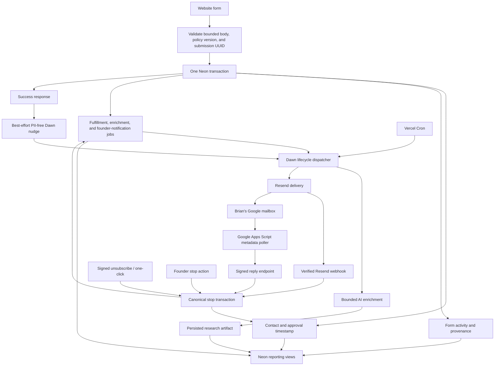

# Threadplane Growth Lifecycle Immediate Hard Cutover

Status: Approved design and independent repository review; pending user review and commit authorization

Date: 2026-09-02

Scope: Website acquisition forms, Neon growth CRM, Dawn lifecycle execution, Resend delivery and webhook handling, Google Workspace reply detection, and removal of the legacy website lifecycle paths

## Context

PR #952 established the reusable growth and lifecycle foundation: Neon-backed contacts, activity, jobs, artifacts, reporting views, stop handling, delivery policy, Resend integration, Google reply processing, Dawn workflows, deployment adapters, and operational tooling. A follow-on website integration exists as an uncommitted draft in the source worktree, mixed with unrelated work. This design defines how to extract only that integration into a clean branch and perform an immediate production cutover.

This document narrows and supersedes the rollout details in `2026-08-31-threadplane-growth-lifecycle-v1-design.md` wherever the earlier design proposed draining already-scheduled legacy messages. The approved policy is now an immediate hard cutover: stop the legacy system, import its state, cancel every outstanding legacy Resend schedule, and rely on Git and Vercel deployment rollback rather than preserving a live legacy fallback.

The system remains intentionally lean:

- Neon is the v1 CRM and operational source of truth.
- `outreach_approved_at` is the single current outreach authorization value.
- Whitepaper, newsletter, contact, and pricing forms grant that approval through the disclosed submission action.
- One hardcoded founder-style campaign is supported.
- Resend remains the only delivery provider.
- Dawn runs deterministic fulfillment and orchestration plus bounded AI enrichment.
- Google Workspace mailbox polling detects natural replies.
- PostHog remains an analytics destination, not the lifecycle CRM.
- Authentication, a campaign builder, an in-house reporting UI, external CRM sync, calendar tooling, inferred-contact prospecting, and broader attribution work are not part of this cutover.

## Goals

1. Make every supported acquisition form durable in Neon before returning success.
2. Remove legacy NDJSON, Loops, Resend Audience, direct-send, and provider-scheduled sequence behavior from the active website paths.
3. Fulfill requested content and queue enrichment/notification work without requiring campaign delivery to be enabled.
4. Make reply, unsubscribe, bounce, complaint, and founder stop durable and authoritative.
5. Cut over without duplicate sends, accidental legacy enrollment, or a hidden runtime fallback.
6. Leave a reporting-friendly database trail for a future agentic operating UI.

## Non-goals

- Changing the public runtime telemetry design or event taxonomy.
- Adding telemetry promises or telemetry marketing copy to the website.
- Reworking PostHog acquisition attribution during this cutover.
- Adding AnyMailFinder or inferring contacts from anonymous telemetry.
- Adding authentication, account administration, a general CRM, a campaign editor, or meeting tooling.
- Building multiple campaigns or configurable sequences.
- Mutating production providers as part of the code pull request.
- Pulling unrelated cockpit, documentation-generation, website-redesign, privacy-copy, or operational-control-plane changes out of the dirty source worktree.

## Locked decisions

### Cutover policy

- The production website switches directly to `growth_v1`; there is no dual write.
- Missing or invalid growth configuration fails closed. It must not silently execute legacy behavior.
- Legacy application code is deleted in the cutover pull request.
- Rollback means reverting the Git change or selecting the prior Vercel deployment. It does not mean selecting a legacy code path at runtime.
- The lifecycle service is deployed before the website boundary, with recipient delivery, campaign enrollment, and campaign delivery disabled.
- Existing Resend contacts and scheduled messages are snapshotted and imported before cancellation. The importer creates a durable legacy marker for every imported contact, including contacts with no scheduled message.
- Every outstanding legacy scheduled message is individually cancelled and the result reconciled against the snapshot.
- The final snapshot must leave a conservative, tool-enforced processing window before the earliest scheduled delivery. If it does not, the cutover aborts before database or provider mutation and is retried in a safe window.
- Imported legacy contacts remain excluded from the new campaign. A later deliberate reauthorization operation may remove that exclusion; ordinary form replay must not do so accidentally.

### Form and outreach policy

- Whitepaper, newsletter, contact, and pricing submissions use a server-controlled `growth_v1` policy and an idempotency UUID generated by the client.
- The currently rendered policy version must accompany the request. A stale or missing version returns `409 Conflict` with the current policy metadata so the client can refresh.
- Whitepaper fulfillment is independent of enrichment and campaign state.
- A successful form response means the Neon transaction committed. It does not claim that email delivery or enrichment already completed.
- `outreach_approved_at` is the only current approval flag. Stops clear it.
- A hard stop cannot be undone by a duplicate submission or ordinary later form submission.
- Existing raw-email unsubscribe URLs may be accepted only as inbound compatibility for messages already sent. All new unsubscribe links use opaque signed tokens.

### Delivery and reply policy

- Campaign and fulfillment email is plain text and should read as a direct message from Brian.
- Resend is used for transport, provider message identifiers, and verified delivery webhooks.
- New campaign jobs are held in Neon until due; Resend must not schedule the future campaign steps.
- Google Workspace is the reply mailbox. A Google Apps Script poller sends only bounded message metadata and reply headers to the signed reply endpoint; it does not persist message bodies in Threadplane.
- Reply, unsubscribe, complaint, hard bounce, founder stop, and invalid address stop future campaign work immediately.
- Open and click tracking stay disabled.

## Target architecture



## Components and boundaries

### Website form boundary

The website owns request parsing, size limits, policy negotiation, user-facing validation responses, and the call into the growth library. It must not own provider delivery or append customer data to local files.

The extraction includes:

- `apps/website/src/lib/growth/form-policy.ts`
- `apps/website/src/lib/growth/form-route.ts`
- `apps/website/src/lib/growth/form-client.ts`
- `apps/website/src/lib/growth/lifecycle-client.ts`
- `apps/website/src/lib/growth/email-keyring.ts`
- `apps/website/src/app/api/_internal/read-bounded-body.ts`
- `apps/website/src/app/api/whitepaper-signup/route.ts`
- `apps/website/src/app/api/newsletter/route.ts`
- `apps/website/src/app/api/leads/route.ts`
- Their focused unit tests

The affected form components are `WhitePaperBlock`, `AnnouncementToast`, `Footer`, `ContactForm`, and `LeadForm`. Only the growth policy, disclosure, UUID, and request-shape hunks are extracted from mixed website pages. Visual redesign and unrelated copy changes remain in the source worktree.

### Durable form acceptance

All form types converge on `acceptFormSubmission()` in `libs/growth/src/lib/forms.ts`. One database transaction:

1. Normalizes and upserts the contact.
2. Records the server-verified form activity and policy provenance.
3. Sets `outreach_approved_at` only when the contact is eligible for approval under the existing stop rules.
4. Creates idempotent fulfillment, enrichment, and founder-notification jobs appropriate to the form.
5. Commits before the route reports success.

The submission UUID is the idempotency boundary. Replaying the same UUID returns the original accepted outcome and does not duplicate contacts, approval events, or jobs. A Dawn nudge occurs only after commit and contains no contact PII. Nudge failure does not fail an already committed form because the periodic dispatcher can recover the durable jobs.

### Lifecycle execution

The website exposes only narrow authenticated adapters:

- `apps/website/src/app/api/cron/lifecycle/route.ts`
- `apps/website/src/app/api/growth/stop/route.ts`
- `apps/website/src/app/api/growth/replies/google/route.ts`
- `apps/website/src/app/api/webhooks/resend/route.ts`
- `apps/website/src/app/api/unsubscribe/route.ts`

Cron and nudges invoke the deployed Dawn lifecycle service. Dawn leases Neon jobs so multiple instances or concurrent nudges cannot send the same job twice. Fulfillment, enrichment, and founder notification can run while campaign enrollment and campaign delivery remain disabled.

### Campaign eligibility

`materializeCampaignEnrollment()` in `libs/growth/src/lib/jobs.ts` is the sole creator of campaign enrollment and sequence jobs. Eligibility requires the current approval event, no hard stop, an approval at or after the immutable cohort timestamp, and all existing campaign invariants.

The importer must create a durable `growth_jobs.kind = 'legacy'` contact marker for every imported Resend contact, not only for contacts with scheduled messages. A contact marker is a terminal, non-dispatchable job with a deterministic idempotency key and a payload subtype that distinguishes it from an imported scheduled message. Imported scheduled messages remain separate legacy jobs with their provider message IDs. Re-running the importer must reproduce the same markers without duplicates or changing approval.

The cutover adds an additional conservative condition: a contact with any imported `growth_jobs.kind = 'legacy'` marker is ineligible for campaign v1. The intended query shape is:

```sql
and not exists (
  select 1
  from growth_jobs legacy
  where legacy.contact_id = c.id
    and legacy.kind = 'legacy'
)
```

This is a correctness blocker for the cutover. Cancellation removes provider-side delivery; the marker exclusion prevents any imported Resend contact from entering the new Neon campaign after a later form submission. A future explicit reauthorization operation may archive or replace the legacy marker after a human decision. Normal form handling must not implicitly do that.

### Stops and provider events

All stop sources converge on the existing canonical stop transaction in `libs/growth/src/lib/stops.ts`. That transaction records provenance, clears `outreach_approved_at`, cancels pending campaign jobs, and reconciles provider state where required. It is idempotent.

New unsubscribe links contain signed opaque tokens. One-click unsubscribe uses the appropriate `List-Unsubscribe` and `List-Unsubscribe-Post` headers. The legacy raw-email endpoint remains input compatibility only and must invoke the same canonical stop operation. When the database is healthy, known and unknown syntactically valid addresses return the same response shape and status. A matched contact receives a success response only after the canonical stop transaction commits. Database or stop failures return one uniform retryable failure and must never be presented as a successful unsubscribe. The endpoint must not reveal whether an arbitrary address exists.

Resend webhook requests require signature verification against the exact raw body. Google reply requests require timestamped HMAC verification, replay protection, bounded metadata, and no message body. Test and production credentials and database environments must remain distinct.

### Reporting trail

Neon remains the operational CRM and future reporting substrate. The cutover records contact state, form provenance, approval, stops, job transitions, provider IDs, delivery events, reply metadata, and enrichment artifacts in the existing growth schema. PostHog may continue to receive bounded acquisition analytics, but PostHog state cannot authorize delivery or become the source of contact state.

Restoring detailed PostHog form-conversion continuity is a separate bounded attribution change after the cutover. It must not delay replacement of the legacy messaging path.

## Legacy removal

The pull request removes active references from the affected website routes to:

- Local NDJSON lead, whitepaper, newsletter, or unsubscribe storage.
- Loops contact creation or workflow events.
- Resend Audience contact synchronization.
- Direct synchronous recipient delivery in a form request.
- Code that schedules future lifecycle messages at Resend.
- Raw-email generation for new unsubscribe links.
- Runtime feature flags that select the legacy form implementation.

Inbound compatibility is narrower than a fallback. The application may continue to accept already-issued legacy unsubscribe links and provider identifiers long enough to stop delivery safely, but it must never resume the legacy write or send paths.

### Legacy cancellation operator

The code pull request includes a narrow operator tool and matching runbook update because the existing importer can snapshot and import provider state but cannot complete the approved cancellation policy. The tool may extend `scripts/import-resend-lifecycle.mts` or be a focused sibling such as `scripts/cancel-resend-lifecycle.mts`, but it must have one responsibility: reconcile imported scheduled legacy jobs with Resend.

The operator workflow must:

1. Preflight the authoritative snapshot before any database or provider mutation. When scheduled messages exist, set the cancellation deadline to five minutes before the earliest `scheduled_at` value and require at least 30 minutes between snapshot time and that deadline. The tool may use larger configured margins but must reject smaller ones.
2. Abort cleanly and remove the temporary form block if the preflight window is insufficient. The operator then chooses a later cutover window; no import or cancellation from the rejected snapshot is allowed.
3. Enumerate every imported legacy job with a scheduled provider message ID without printing those IDs in ordinary output.
4. Require an expected aggregate count, an explicit apply mode, the correct database environment, and a separate production acknowledgement.
5. Cancel each provider message through Resend's supported single-message operation; no bulk or recipient-derived cancellation is allowed.
6. Record each confirmed cancellation against the exact legacy job with terminal job state and a durable activity event.
7. Leave failed or ambiguous cancellations durable and visibly unresolved rather than marking them complete.
8. Re-list all Resend scheduled messages after the pass and reconcile the provider result against the imported set.
9. Fail the cutover if full cancellation and reconciliation have not completed before the calculated cancellation deadline, even if no provider error was returned.
10. Report aggregate counts, remaining safe-window duration, and stable error categories only. Exact provider IDs stay in the restricted database/provider session.

Campaign enrollment and campaign delivery remain disabled until the tool reports zero unresolved imported schedules and zero unexpected scheduled messages. The production execution of this tool is an authorized runbook action after the code pull request is green and merged.

## Data flow

### Form submission

1. The browser generates a submission UUID and submits bounded fields plus the rendered policy version.
2. The route checks content type, body size, field lengths, form kind, and policy version.
3. The route calls `acceptFormSubmission()`.
4. Neon atomically records the contact, activity, approval state, and jobs.
5. The route returns the accepted response.
6. The route makes a best-effort PII-free lifecycle nudge after commit.
7. Dawn leases due jobs and persists each state transition.
8. Fulfillment sends the requested asset exactly once, independently of campaign state.
9. Enrichment persists a structured research artifact and founder notification summarizes the result.
10. Campaign enrollment remains disabled until the operational cutover gates pass.

### Stop signal

1. A signed unsubscribe, verified webhook, verified Google reply, or authenticated founder action reaches a narrow endpoint.
2. The endpoint validates authenticity, replay rules, and bounded input before mutation.
3. The canonical stop transaction records the event and clears approval.
4. Pending campaign work is cancelled. Ambiguous in-flight provider work is reconciled by provider ID rather than blindly resent.
5. Repeating the same stop event returns an idempotent outcome.

## Failure semantics

| Failure | Required behavior |
| --- | --- |
| Neon unavailable during form submission | Return `503 Service Unavailable`; do not send, enrich, notify, or claim acceptance. |
| Missing or invalid `GROWTH_FORM_POLICY` | Fail closed; do not select legacy behavior. |
| Missing or stale browser policy version | Return `409 Conflict` with current policy metadata; do not mutate Neon. |
| Duplicate submission UUID | Return the accepted idempotent result; create no duplicate jobs. |
| Dawn nudge unavailable after commit | Return form success; cron later processes the durable jobs. |
| Dawn instance fails while processing | Lease expires or retry policy recovers the job without duplicate provider acceptance. |
| Resend accepts but response is ambiguous | Persist/reconcile idempotency and provider identifiers; do not blindly retry a recipient send. |
| Resend webhook signature invalid | Reject with no mutation. |
| Google reply signature, timestamp, or replay check invalid | Reject with no mutation. |
| Legacy schedule cancellation incomplete | Keep affected forms blocked during the cutover critical section and keep campaign enrollment and delivery disabled. Preserve exact unresolved provider IDs in restricted durable state; emit only aggregate counts to ordinary logs. |
| Stop races with provider submission | Persist the stop and reconcile bounded in-flight state; no later campaign step may send. |
| A post-cutover defect requires rollback | Revert Git or select the prior Vercel deployment. Treat Neon-accepted jobs as durable state requiring explicit operational control; do not activate a hidden dual-write fallback. |

## Production cutover sequence

1. Extract only the growth website integration and focused tests from the dirty source worktree into this clean branch based on `origin/main`.
2. Delete the legacy execution paths and add the imported-legacy campaign exclusion plus its tests.
3. Run focused unit, integration, build, and static-boundary verification against a disposable Neon database.
4. Provision distinct production Growth Neon and Dawn Neon databases, then apply and verify migrations.
5. Deploy the lifecycle project to production with fulfillment delivery, campaign enrollment, and campaign delivery disabled.
6. Configure the production website for `growth_v1`, but do not expose the new boundary yet.
7. Begin a short quiescent critical section by installing a temporary Vercel Firewall rule that returns a retryable maintenance response for POST requests to `/api/whitepaper-signup`, `/api/newsletter`, and `/api/leads`. Verify all three routes are blocked and that no route can create a new provider schedule. Keep the rule active until step 11 completes.
8. Take the authoritative live Resend contact and scheduled-message snapshot. Before any mutation, require the cancellation tool to prove at least its 30-minute minimum processing window before the calculated deadline ahead of the earliest scheduled delivery. If the preflight fails, remove the form block and retry in a later safe window. If it passes, import every contact with a durable legacy marker and every scheduled message as a provider-bound legacy job.
9. Run the cancellation operator against the imported set. Cancel each outstanding scheduled message individually, persist each result, and re-list Resend. Complete before the calculated cancellation deadline and do not proceed until reconciliation proves zero unresolved imported schedules and zero unexpected scheduled messages.
10. Deploy the production website hard boundary while the form-route firewall remains active. Verify the deployed artifact has `growth_v1`, contains no active legacy form branch, and can reach the intended production Growth database and lifecycle service without enabling recipient delivery.
11. Remove the temporary firewall rule and run one no-delivery form persistence smoke test. New submissions now commit only to Neon and queue jobs; no legacy branch remains.
12. Register and verify the Resend webhook. Deploy and verify the Google mailbox poller against the production reply endpoint.
13. Enable lifecycle cron and recipient delivery for fulfillment, enrichment, and founder notification. Drain and inspect those job classes while campaign enrollment and delivery stay off.
14. Set `CAMPAIGN_ENROLLMENT_START_AT` once to the instant the forms reopened in step 11. Enable enrollment, inspect eligible contacts and created jobs, and only then enable campaign delivery.

The provider inventory must be freshly read immediately before mutation. Previously observed counts are planning context, not an execution precondition.

## Rollback and recovery

There is no application-level legacy fallback. Code rollback uses Git and Vercel deployment history, but an older website deployment must never receive affected form POST traffic because it contains the removed side effects.

- Before selecting a prior website deployment, install the same Vercel Firewall block for all affected form POST routes. Keep the routes blocked while the deployment changes and while database/provider state is reconciled.
- A prior deployment may temporarily serve unaffected pages behind that route block, but the form routes reopen only on a deployment that preserves the Neon hard boundary. A prepared Git rollback artifact may revert unrelated application changes while retaining those route implementations.
- Before enabling delivery, rollback preserves the committed Neon queue, blocks form ingress, and restores a deployment that retains the hard boundary.
- After fulfillment delivery is enabled, accepted jobs remain authoritative and visible in Neon. Operators pause delivery and block form ingress before changing deployments.
- After campaign delivery is enabled, operators first disable enrollment and campaign delivery, inspect in-flight provider state, and then revert.
- Imported/cancelled legacy Resend schedules are not recreated automatically during rollback.
- Before reopening forms, reconcile every accepted Neon submission and every provider acceptance during the rollback window so a roll-forward cannot duplicate customer effects.
- A rollback must never replay NDJSON, re-add contacts to Resend Audience, or allow provider-scheduled drip behavior to receive traffic without a new explicit decision.

## Acceptance gates

### Repository scope

- The clean pull request contains only the website growth integration, required configuration/dependency changes, focused tests, legacy deletion, the legacy-contact exclusion, importer/cancellation operator changes, and the matching cutover runbook update.
- It contains no unrelated cockpit, generated-documentation, website-redesign, privacy-copy, telemetry, or operational-control-plane changes from the source worktree.
- A static boundary test fails if the affected production routes import filesystem PII storage, Loops, Resend Audience helpers, legacy scheduling, or direct recipient sends.

### Form correctness

- Missing/invalid server policy fails closed.
- Missing/stale submitted policy returns `409` without mutation.
- Oversized or malformed request bodies are rejected before database work.
- Duplicate submission UUIDs produce one acceptance event and one logical set of jobs.
- Whitepaper, newsletter, contact, and pricing forms all persist through the same durable boundary.
- A successful response is impossible without a committed Neon transaction.
- A failed post-commit nudge does not lose work.

### Approval and stop correctness

- Ordinary form submission cannot undo unsubscribe, complaint, hard bounce, reply, founder stop, deletion, or another protected hard stop.
- Every marketing send performs the final approval and stop check immediately before provider submission.
- Signed unsubscribe and one-click unsubscribe converge on the same canonical stop transaction.
- Legacy raw-email unsubscribe input returns the same healthy result for known and unknown valid addresses, but a database/stop failure returns a uniform retryable failure rather than false success.
- Duplicate webhook, reply, unsubscribe, and founder-stop events are idempotent.

### Legacy cutover correctness

- The Resend snapshot records every relevant contact and scheduled message before mutation.
- Import produces one deterministic legacy contact marker for every imported Resend contact, plus deterministic provider-bound records for scheduled messages, without granting approval.
- Importing a contact with no scheduled message still creates the exclusion marker.
- `materializeCampaignEnrollment()` excludes every contact with a legacy marker, including after that contact later submits an approving form.
- Every outstanding legacy scheduled message is individually cancelled and verified.
- The cancellation operator persists confirmed and unresolved per-message outcomes, emits aggregate-only ordinary output, and re-lists the provider after cancellation.
- Cancellation preflight rejects a snapshot before mutation when it lacks the minimum 30-minute processing window, and the successful path proves final reconciliation completed before the calculated deadline.
- Campaign enrollment cannot be enabled while cancellation reconciliation reports an unresolved or unexpected legacy schedule.
- During the quiescent critical section, all three affected form POST routes are blocked before the authoritative snapshot and stay blocked until the hard boundary is verified.
- Production code performs no NDJSON, Loops, Resend Audience, direct-form-send, or provider-scheduled drip side effect.

### Lifecycle and delivery correctness

- Disposable-Neon integration tests cover migrations, forms, jobs, stops, replies, and the new legacy exclusion.
- Concurrent nudges and at least two Dawn instances cannot duplicate a provider send.
- Preview form submissions create expected rows and jobs with all provider delivery switches off.
- Enabling fulfillment sends one whitepaper request exactly once and persists the provider message ID and delivery status.
- A verified Resend webhook advances delivery state; a forged webhook does nothing.
- A detected Google reply clears approval and cancels pending campaign work.
- Failure after ambiguous provider acceptance does not cause a blind duplicate retry.
- Test fixtures clean up only their exact rows and leave the disposable database in the expected state.

### Production readiness

- Production Growth and Dawn databases are distinct from preview and test.
- Required secrets are present in the correct Vercel projects and environments; values are not logged.
- The configured sender uses an authenticated Threadplane domain with verified SPF, DKIM, DMARC, Return-Path behavior, Reply-To, `List-Unsubscribe`, and `List-Unsubscribe-Post` where applicable.
- Resend open and click tracking remain disabled.
- Campaign enrollment and delivery remain off until fulfillment and reply-handling canaries pass.
- One production whitepaper canary is fulfilled exactly once, visible in Neon, Resend, and the mailbox.
- The first campaign cohort is inspected before campaign delivery is enabled.

## Verification plan

The implementation plan must select the smallest repository-native commands that prove each layer. At minimum it should include:

- Project-scoped unit tests for `growth`, `lifecycle`, and `website` route/components affected by the extraction.
- Growth integration tests against the disposable Neon database.
- Import/cancellation operator tests covering contact markers, per-message settlement, partial provider failure, idempotent rerun, and final inventory reconciliation.
- Lifecycle Vercel adapter verification and production-bundle inspection.
- Website and lifecycle builds through Nx.
- Static searches/tests proving removal of legacy imports and side effects.
- Preview form and lifecycle runtime canaries with delivery disabled.
- Production inventory reconciliation and canaries performed from the cutover runbook, not from automated test fixtures.

No completion claim may depend only on mocked provider behavior. Production provider mutations occur during the reviewed runbook after the code pull request is green and merged.

## Pull request boundary

The implementation is one focused hard-cutover code pull request followed by an operational cutover:

- Extract the approved website integration from the source worktree.
- Add the legacy-contact exclusion and tests.
- Extend the legacy importer to mark every imported contact and add the narrow cancellation operator plus runbook coverage.
- Remove active legacy implementation and dependencies from the touched paths.
- Add the minimum Vercel/environment wiring required by those paths.
- Preserve the already-merged growth/lifecycle foundation.
- Keep telemetry attribution continuity, website privacy copy, cockpit work, and broader UI changes outside this pull request.

Mixed files must be reconstructed or staged hunk-by-hunk. The source worktree is not a patch source to apply wholesale.

## Next arc after cutover

Once the cutover is stable, the next design cycle can connect bounded runtime signals to account-level scoring, deterministic research, AI enrichment, and founder approval-driven outreach. That work should preserve the same boundary: anonymous or client-reported signals may prioritize research, but person-specific sending requires a real contact and an active `outreach_approved_at` timestamp. A future agentic reporting UI can read the same Neon event and job history without changing the v1 operational model.
